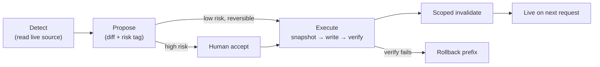

# Evolve for autonomous streams: detect, propose, execute on the live source

> **Status: draft.** Design + investigation plan. Investigation is complete; the recommended
> approach and phases are **proposals** pending the [§ Open decisions](#-open-decisions). Parent:
> [strat-review overview](overview.md) · depends on the write path, invalidation (00.03), and auth
> (02).

---

## 🎯 Goal

Wire **autonomous streams to the same content source the site reads**, so a stream's
**detect → propose → execute** edits go **live immediately** — over a reversible, authorized write
path with scoped invalidation.

## 🧭 Motivation

The [self-updating engine](../../../../../06.00-idea/self-updating-engine/20260622.01-self-updating-engine-vision.md)
and [autonomous-streams](../../../../../06.00-idea/autonomous-streams/autonomous-streams.md) visions
define a Detect → Assess → Propose → Execute loop with an autonomy gradient and reversible-by-default
edits. Today those loops would operate on a repo clone and rely on a separate publish. If instead a
stream writes through the **same** `IContentSource` the renderer reads, there is **no publish gap** —
an accepted edit is live on the next request. That is the point of a markdown-first, no-build platform.

## 🔎 Investigation: what a stream needs from the platform (✅ done)

- **Read is ready.** A stream can already **detect** by reading the live tree via `IContentLister`
  (`ListChildrenAsync`/`ReadHeadAsync`) and content via `IContentSource.GetAsync` — the same view the
  site renders.
- **Execute is missing.** There is **no write path**. Streams need `IContentWriter`
  (`PutAsync`/`DeleteAsync`) — the shared capability also required by ordering (00.02) and the
  documentation-manager (01).
- **Reversibility needs a snapshot.** The engine's *reversible-by-default* principle requires a
  pre-change snapshot + one-operation rollback. Neither content source offers versioning today (blob
  versioning/soft-delete could back this; the filesystem needs an explicit snapshot copy).
- **Going live needs scoped invalidation.** After an accepted write, the stream must call scoped
  `POST /_nav/invalidate?prefix=<segment>` (plan 00.03) so nav/index reflect the change without a full
  rebuild.
- **Execute must be authorized.** A stream acts as a principal with write rights — the auth boundary
  from plan 02 governs it. Anonymous write is never allowed.

## 🧩 Recommended approach: a governed write-through loop (🟡 todo)

- **Streams share the renderer's content source.** Detect/propose read the **live** source; execute
  writes back through `IContentWriter` to that **same** source — no side copy, no publish step. (🟡 todo)
- **Reversible-by-default execution.** Every execute is `snapshot → write → verify → (rollback on
  failure)`. Back the snapshot with **blob versioning/soft-delete** (prod) and an explicit snapshot
  copy (filesystem/dev). A stream can roll back a prefix to its pre-change state in one operation.
  (🟡 todo — design decision)
- **Autonomy gradient gates what auto-applies.** Low-risk, reversible edits (typo/link fixes, metadata
  touch-ups) apply autonomously; higher-impact edits produce a **proposal** that a human accepts
  before execute. The gradient is the engine's, not re-invented here. (🟡 todo)
- **Immediate liveness.** On accept, write + scoped invalidate → the edit is live on the next request.
  (🟡 todo)
- **Mounts scope the blast radius.** A stream is bound to a mount / prefix (e.g. one project's docs,
  or the curated tree) so its authority and its invalidation are naturally scoped. (🟡 todo)

## 🗺️ The loop over the live source (✅ done)

## 🪜 Proposed implementation phases (🟡 todo)

1. **Phase 0 — read-only stream.** A stream detects + proposes against the live source and writes its
   proposal as a **draft artifact** (no mutation of published content). Proves detect/propose on live
   data. (🟡 todo)
2. **Phase 1 — governed write path.** Add `IContentWriter` + snapshot/rollback; execute low-risk,
   reversible edits behind auth; scoped-invalidate on success. (🟡 todo)
3. **Phase 2 — autonomy gradient + escalation.** Wire risk tagging so low-risk edits auto-apply and
   higher-impact ones require human accept; record outcomes for threshold tuning (TuneIQ). (🟡 todo)
4. **Phase 3 — scoped streams per mount.** Bind streams to specific mounts/prefixes with per-stream
   authority and invalidation scope. (🟡 todo)

## ❓ Open decisions

- **D1-snapshot-backing** — back reversibility with **blob versioning/soft-delete** (recommended in
  prod) vs. an **explicit snapshot store**; and what to use in dev/filesystem. *Resolves:* storage
  capabilities + user preference. *Gates:* Phase 1 rollback.
- **D2-auto-apply-threshold** — which edit classes may **auto-apply** in v1 (recommended: link/typo/
  metadata only) vs. always-propose? *Resolves:* user's risk tolerance. *Gates:* Phase 2 gradient.
- **D3-proposal-surface** — where do human-accept proposals live: a **private mount** (plan 02), a PR,
  or an in-site review queue? *Resolves:* user workflow preference. *Gates:* Phase 0/2 review UX.

## 🔭 Discovery

- **DS1-concurrent-writers** — a stream and a human (or another stream) may write the same prefix.
  *At Phase 1* → use ETag/optimistic concurrency on `PutAsync` (the sources already surface ETags);
  on conflict, re-detect and re-propose rather than overwrite.

## 🅿️ Park lot

- **Two-way sync to the origin repo** (site edits flowing back to source control). → `defer`
- **Multi-step transactional edits** across many files with all-or-nothing rollback. → `defer`
- **Live push to open browsers** on stream edits (SignalR). → `00.03` park lot

## 📚 References

- [Autonomous streams](../../../../../06.00-idea/autonomous-streams/autonomous-streams.md) 📒 [Internal]  
The runtime loop this plan runs against the live content source.
- [Self-updating engine: vision and rationale](../../../../../06.00-idea/self-updating-engine/20260622.01-self-updating-engine-vision.md) 📒 [Internal]  
The reversible, gradient-gated machinery the write-through loop obeys.
- [Security design (reverse-engineering set)](../../../../../06.00-idea/autonomous-streams/reverse-engineering/07.design-security.md) 📒 [Internal]  
Security posture patterns relevant to authorized autonomous writes.
- [Invalidation plan](00.03-learning-hub-improvements-invalidation-plan.md) · [Validation-manager / private-mirror plan](02-evolve-for-validation-manager-plan.md) 📒 [Internal]  
The scoped invalidation and auth boundary this loop depends on.
