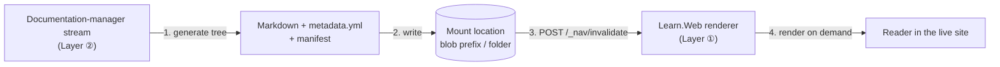

# Live documentation hosting: serving generated doc trees with no build

**Review date:** 2026-07-20  
**Author:** Dario Airoldi  
**Status:** 🧭 Design / spec — proposed next capability (not yet implemented)  
**Type:** Strategic-review outcome + capability specification  
**Component:** `Learn.Web` (dynamic renderer · runtime navigation · `IContentSource`)  
**Layer:** ① Platform (host) + ② Content Engine (documentation-manager stream)

> **Context.** This document records the outcome of the Learning Hub strategic review and specifies the
> capability the review recommended next. For the canonical three-layer definition it builds on, see the
> [Learning Hub master](../../../../../06.00-idea/learning-hub/00-learning-hub.md).

---

## 📑 Table of contents

- [📝 Summary](#-summary)
- [🧭 Strategic-review outcome](#-strategic-review-outcome)
- [🎯 Problem and opportunity](#-problem-and-opportunity)
- [🏗️ Proposed design: mountable content](#️-proposed-design-mountable-content)
- [🔀 How a documentation-manager stream publishes](#-how-a-documentation-manager-stream-publishes)
- [⚙️ Configuration and surfaces](#️-configuration-and-surfaces)
- [🔒 Boundaries and public-repo safety](#-boundaries-and-public-repo-safety)
- [🪜 Phased plan](#-phased-plan)
- [❓ Open questions](#-open-questions)
- [🗂️ Detailed plans](#️-detailed-plans)
- [✅ Recommendation](#-recommendation)
- [📚 References](#-references)

---

## 📝 Summary

The strategic review consolidated roughly ten peer "visions" into **three layers and one frame**: ① a
**Platform** that delivers, ② a **Content Engine** that produces, and ③ a **Learning Loop** that compounds —
all under the *own-the-loop* framing. It established a single [canonical master](../../../../../06.00-idea/learning-hub/00-learning-hub.md),
rescoped IQPilot (Layer ②) and TuneIQ (Layer ③) to treat the live site as a first-class surface, and folded
the `self-updating-{prompt-engineering,article-writing,research}` trio into **one engine with per-domain
streams**.

The review's top recommendation follows directly from what the Platform already does: because `Learn.Web`
**renders Markdown on demand** and **builds navigation at runtime**, "publishing" collapses to *making the
Markdown available to the app*. This document specifies how to turn that property into a first-class
capability — **live documentation hosting** — so a **documentation-manager stream** (Layer ②) can generate a
documentation tree and have it appear in the site with **no build and no redeploy**.

---

## 🧭 Strategic-review outcome

- **Canonical master established** — a single entry point with Vision · Strategy · Implementation · Next
  steps and the three-layer map. See [00-learning-hub.md](../../../../../06.00-idea/learning-hub/00-learning-hub.md).
- **Platform + audiences generalized** — the dynamic renderer and its customer-free consumers (learner,
  documentation manager, validation manager, app-dev doc generation). See
  [04-platform-and-consumers.md](../../../../../06.00-idea/learning-hub/04-platform-and-consumers.md).
- **One engine, many streams** — the self-updating trio folded under one engine. See
  [00-one-engine-many-streams.md](../../../../../06.00-idea/self-updating-engine/00-one-engine-many-streams.md).
- **Architecture already resolved** — the markdown-first migration is done; the site renders on demand with
  runtime navigation. See the sibling recap [20270711.02-progressive-build](../20270711.02-progressive-build/overview.md).

---

## 🎯 Problem and opportunity

Today the renderer serves **one** curated content tree — the filesystem repo root in development, an Azure
Blob container in production, selected by the `Content:Source` configuration. That is exactly right for the
hand-authored Learning Hub, but two Layer-② consumers produce content that currently has **nowhere to live**
without a build or a redeploy:

- **App-dev doc generation** — documentation generated from an application's own codebase.
- **Repo-to-docs pipelines** — a source repository transformed into a structured, navigable Markdown tree.

The opportunity is that the Platform **already** removes the two costs a build would impose: rendering
happens per request, and navigation is discovered at runtime from the content hierarchy. So the only thing
missing is a supported way to **attach an additional tree** and have the renderer treat it like any other
section. We call such an attached tree a **mount**.

---

## 🏗️ Proposed design: mountable content

Introduce the concept of a **mount**: a labeled subtree the renderer serves from a source, appearing in the
navigation as a section via its own root `metadata.yml`.

- **Composite content source.** Add a `CompositeContentSource` that overlays one or more mounts onto the
  primary curated root. Each mount is namespaced by a **route prefix** so its keys never collide with curated
  content. The existing `FileSystemContentSource` / `BlobContentSource` become the *providers* a mount can use.
- **Zero renderer changes.** Because a mount resolves to the same `IContentSource` contract, on-demand
  Markdig rendering works unchanged — a mounted `.md` renders exactly like a curated one.
- **Navigation is free.** `DynamicNavBuilder` already walks the hierarchy and honors per-folder
  `metadata.yml` (`label` / `icon` / `order` / `hidden` / `topbar-*`). A mount's **root `metadata.yml`**
  controls how it slots into the sidebar and top bar — no special-casing.
- **Live publish via existing invalidation.** After a stream writes files, it calls the existing
  `POST /_nav/invalidate` endpoint; the next request rebuilds nav and the tree is live. No build, no
  restart.
- **Provenance manifest.** Each mount carries a small manifest (generator / stream id, source reference,
  generated-at timestamp, item count) surfaced in the UI so readers know the content is machine-generated
  and how fresh it is.

---

## 🔀 How a documentation-manager stream publishes

The stream owns steps 1–3; the Platform owns step 4. Nothing between the stream and the reader performs a
build. The same reversible, gated discipline described in
[one engine, many streams](../../../../../06.00-idea/self-updating-engine/00-one-engine-many-streams.md)
applies: the stream snapshots before writing and can roll a mount back by restoring the previous prefix.

---

## ⚙️ Configuration and surfaces

- **`Content:Mounts`** — a configuration array; each entry declares `id`, `provider` (`fileSystem` | `blob`),
  `location` (folder path or blob prefix), `routePrefix`, and `visibility` (`public` | `private`). This reuses
  the selection semantics already established by `Content:Source`.
- **Root `metadata.yml` per mount** — placement and labeling, identical to curated folders.
- **Manifest file per mount** — machine-readable provenance, surfaced as a small "generated" banner.
- **`POST /_nav/invalidate`** — the freshness signal a stream sends after publishing (already implemented).

---

## 🔒 Boundaries and public-repo safety

- **Public vs. private mounts** map to the audiences in
  [platform and consumers](../../../../../06.00-idea/learning-hub/04-platform-and-consumers.md): a public mount
  is served to everyone; a **private mount is gated by authentication** (introduced by the
  [private-mirror plan](02-evolve-for-validation-manager-plan.md) — the app is anonymous today) and is never
  served to anonymous sessions.
- **Provenance always visible** — readers must be able to tell machine-generated content from curated
  content, and see how fresh it is.
- **Customer-agnostic by construction** — this specification names **no** customer, application, or product.
  Mounts are described generically ("a source repository", "an application's codebase"). The mechanism must
  never require embedding customer identifiers in the public repository: mount `location` values that point at
  private sources belong in deployment configuration, not in tracked files.

---

## 🪜 Phased plan

| Phase | Scope | Why this order |
|---|---|---|
| **0** | Single **filesystem** mount + `/_nav/invalidate` in development | Fully reversible; touches only `IContentSource` composition + config. Proves live-publish end to end. |
| **1** | **Blob-backed** mount in production; stream writes to a blob prefix | Extends Phase 0 to the deployed site with no renderer changes. |
| **2** | **Multiple** mounts + per-mount visibility (public/private) + manifest banner | Serves the full audience matrix; adds provenance UI. |
| **3** | **Automated** documentation-manager stream (generate → publish → invalidate → verify) under engine discipline | Closes the loop with reversible, gated autonomy. |

---

## ❓ Open questions

Each question is now investigated and answered in a sibling plan (all `status: draft`, pending
ratification of their open decisions):

- **Config shape** (static `appsettings` vs. runtime-discoverable) → [mount plan](00.01-learning-hub-improvements-mount-plan.md).
  *Recommendation:* composite route-prefixed mounts, layered **static → runtime registry → convention-discovered** (the OneDrive model).
- **Ordering** (how mounts sort vs. curated sections) → [ordering plan](00.02-learning-hub-improvements-ordering-plan.md).
  *Recommendation:* a **per-parent ordering manifest** with OneNote-style drag-and-drop; mounts **interleave**, no reserved band.
- **Collision policy** (`routePrefix` overlaps a curated path) → [conflict-resolution plan](00.04-learning-hub-improvements-conflres-plan.md).
  *Decision:* **prevention-first** (fail-fast startup validation) + **primary-wins-and-warn** at runtime.
- **Invalidation granularity** (per-mount vs. global) → [invalidation plan](00.03-learning-hub-improvements-invalidation-plan.md).
  *Recommendation:* **per-prefix versioning + targeted eviction**; also **restore the lost `InvalidateApiKey` guard**.
- **Auth model** (private mounts) → [validation-manager / private-mirror plan](02-evolve-for-validation-manager-plan.md).
  *Finding:* the app has **no authentication today** — the private mirror is greenfield.

---

## 🗂️ Detailed plans

**Platform improvements (the four open questions):**

1. [Mount configuration](00.01-learning-hub-improvements-mount-plan.md) — how the renderer hosts multiple content sources.
2. [Navigation ordering](00.02-learning-hub-improvements-ordering-plan.md) — persisted, drag-and-drop reordering of sections and mounts.
3. [Cache invalidation](00.03-learning-hub-improvements-invalidation-plan.md) — per-mount granularity + restored API-key guard.
4. [Conflict resolution](00.04-learning-hub-improvements-conflres-plan.md) — route-collision policy.

**Capability evolution (roadmap #5–#8):**

- #5 → [Documentation-manager](01-evolve-for-documentation-manager-plan.md) — autonomous docs for software projects, rendered live (UI customization first-class).
- #6 + #7 → [Validation-manager & private mirror](02-evolve-for-validation-manager-plan.md) — live validation dashboards behind an authenticated trust boundary.
- #8 → [Autonomous streams](03-evolve-for-autonomous-streams-plan.md) — detect→propose→execute on the live source.

---

## ✅ Recommendation

Start with **Phase 0**: a single filesystem-backed mount composed onto the primary content source, published
live via the existing `/_nav/invalidate` endpoint. It is fully reversible, requires no renderer changes, and
touches only `IContentSource` composition plus a small `Content:Mounts` config block. Proving live-publish
there de-risks every later phase and delivers the review's headline recommendation — the Platform hosting a
generated documentation tree — with the smallest possible surface area.

---

## 📚 References

- [Learning Hub master](../../../../../06.00-idea/learning-hub/00-learning-hub.md) 📒 [Internal]  
The canonical three-layer definition this capability extends (Layer ① hosting Layer ② output).
- [Platform and consumers](../../../../../06.00-idea/learning-hub/04-platform-and-consumers.md) 📒 [Internal]  
The renderer and the audiences a documentation-manager stream serves.
- [One engine, many streams](../../../../../06.00-idea/self-updating-engine/00-one-engine-many-streams.md) 📒 [Internal]  
The reversible, gated stream discipline the publish step follows.
- [Progressive build resolved: markdown-first dynamic site](../20270711.02-progressive-build/overview.md) 📒 [Internal]  
The migration recap that established on-demand rendering and runtime navigation.
