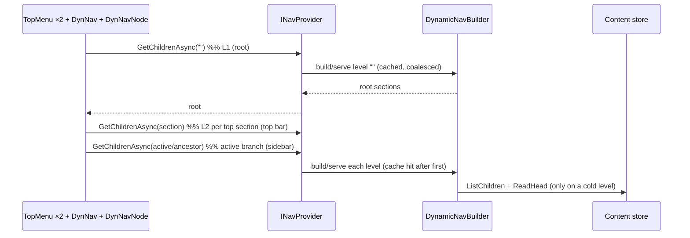
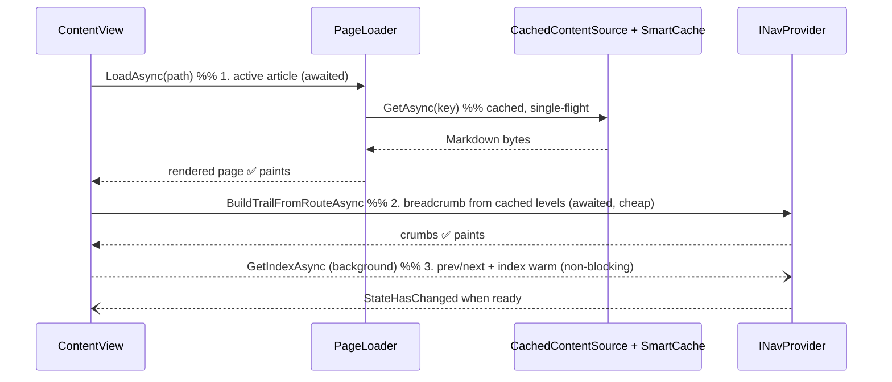
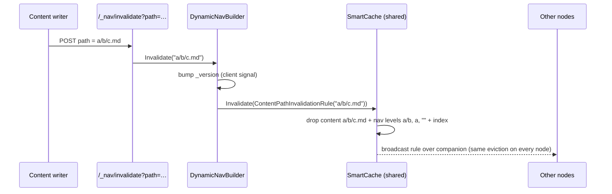

# Learning Hub — page loading process flow

**Date:** 2026-07-23
**Author:** Dario Airoldi
**Status:** ℹ️ Reference (current behaviour)
**Component:** Learn.Web (server host) + Learn.Web.Client (WASM) navigation & content loading
**Related:** [overview.md](overview.md) · [01.smartcache-doesnt-coalesce.md](01.smartcache-doesnt-coalesce.md)

---

## 📑 Table of Contents

- [📝 Overview](#-overview)
- [🧩 Actors](#-actors)
- [🧭 How the menu loads](#-how-the-menu-loads)
- [📄 How the content loads](#-how-the-content-loads)
- [🗃️ Caching layers](#️-caching-layers)
- [🔁 Cache invalidation](#-cache-invalidation)
- [❓ Is visible & top-level content prioritized?](#-is-visible--top-level-content-prioritized)
- [❓ Are menu loading and content loading cached?](#-are-menu-loading-and-content-loading-cached)
- [✅ Summary](#-summary)

---

## 📝 Overview

The Learning Hub is a **prerendered Blazor WebAssembly** app. The same components run twice:

1. **Server prerender** — the first HTML is produced on the server. Navigation and content are read
   **in-process** (no HTTP).
2. **WASM (after hydration)** — the app becomes interactive in the browser. Navigation and content
   are fetched over **HTTP** from the server's `/_nav/*` and `/_content-raw/*` endpoints.

A single abstraction hides the difference: `INavProvider` for the menu and `IContentSource` for
content, each with a server implementation and a WASM implementation.

The menu is built **one level at a time** from the live content hierarchy; content is a
**Markdown-source fetch + Markdig render** per page.

---

## 🧩 Actors

| Concern | Server (prerender) | WASM (browser) |
|---|---|---|
| **Menu** | [ServerNavProvider](../../../../../src/Learn.Web/Navigation/ServerNavProvider.cs) → [DynamicNavBuilder](../../../../../src/Learn.Web/Navigation/DynamicNavBuilder.cs) | [HttpNavProvider](../../../../../src/Learn.Web.Client/HttpNavProvider.cs) → `/_nav/*` → `DynamicNavBuilder` |
| **Content** | [CachedContentSource](../../../../../src/Learn.Web/ContentSources/CachedContentSource.cs) → FileSystem/Blob | [HttpContentSource](../../../../../src/Learn.Web.Client/HttpContentSource.cs) → `/_content-raw/*` → `CachedContentSource` |
| **Menu UI** | — | [TopMenu](../../../../../src/Learn.Web.Client/Layout/TopMenu.razor.cs) (×2), [DynNav](../../../../../src/Learn.Web.Client/Layout/DynNav.razor.cs), [DynNavNode](../../../../../src/Learn.Web.Client/Layout/DynNavNode.razor.cs) |
| **Content UI** | [ContentView](../../../../../src/Learn.Web.Shared/Components/ContentView.razor.cs) + [PageLoader](../../../../../src/Learn.Web.Shared/Services/PageLoader.cs) | same (shared RCL) |

---

## 🧭 How the menu loads

The menu is fetched **level-by-level, per prefix**. Three components drive it on first render:

| Component | Call(s) | Levels |
|---|---|---|
| **TopMenu** (left + right instances) | `GetChildrenAsync("")`, then `GetChildrenAsync(prefix)` for each shown section | **L1 + L2** (top sections' children, prefetched for the dropdowns) |
| **DynNav** (sidebar) | `GetChildrenAsync("")` | **L1** |
| **DynNavNode** (recursive) | `GetChildrenAsync(prefix)` for each ancestor of the active route (`InActiveBranch`) | **active-branch levels** |

Deeper levels load **lazily** — a sidebar section fetches its children the first time it opens (or
when it contains the active route, or on expand-all).

**Menu search / prev-next** use a different call, `GetIndexAsync()` — a **flatten of the whole tree**
(the expensive cold path). It is *not* part of the eager menu render.

---

## 📄 How the content loads

The routable page hosts `ContentView`, whose `OnParametersSetAsync` runs in this order:

1. **Active article (awaited):** `PageLoader.LoadAsync(path)` → `IContentSource.GetAsync` → Markdown
   bytes → Markdig render. On the server this passes through `CachedContentSource` (SmartCache); in
   WASM it is an HTTP GET to `/_content-raw/{key}` which the server serves from the same
   `CachedContentSource`.
2. **Breadcrumb (awaited, cheap):** built from **per-level nav** (`BuildTrailFromRouteAsync`) using the
   already-cached active-branch levels plus the article title — **no** whole-tree index needed.
3. **Prev/next (background):** `LoadPrevNextAsync` fetches the **flat index** (`GetIndexAsync`) and
   renders itself when ready. It is **fire-and-forget** so a cold index walk never blocks the article.

A **startup background warm-up** ([Program.cs](../../../../../src/Learn.Web/Program.cs)) kicks off
`GetIndexAsync()` right after host build, so the whole-tree walk is usually already warm by the time
any page needs prev/next or search.

---

## 🗃️ Caching layers

| Layer | Where | What it caches | Policy |
|---|---|---|---|
| **Server nav cache** | `DynamicNavBuilder` → **SmartCache** | one built level per prefix; the flat index | level: **60 s sliding**; index: **15 min sliding**; keyed on `ContentPathCacheKey` (path-invalidatable) |
| **Server nav coalescing** | `DynamicNavBuilder` (SmartCache `CoalesceRacingCacheMisses`) | in-flight builds | concurrent same-key callers share one origin build (single-flight) |
| **Client nav cache** | `HttpNavProvider` (`Dictionary<prefix, Task>`) | the fetch **task** per prefix + the index task | in-memory for the session; shared across sidebar + both top bars |
| **Top-bar cache** | `TopMenu` (`Dictionary`) | prefetched L2 children per placement | in-memory for the component lifetime |
| **Server content cache** | `CachedContentSource` → **SmartCache** | Markdown **source bytes** per key | **MaxAge 01:00:00** (in-memory), racing-miss **coalescing**; keyed on `ContentPathCacheKey` (path-invalidatable) |
| **Client content** | `HttpContentSource` | — (**no** client result cache) | each navigation re-requests `/_content-raw`; the **server** answers from SmartCache |

Notes:
- Both the menu cache and the content cache now share **one SmartCache instance** and one key type
  ([ContentPathCacheKey](../../../../../src/Learn.Web/Caching/ContentPathCacheKey.cs)), so a single
  invalidation drops the article **and** its menu levels together (see below).
- Only **Markdown** keys (`.md`/`.qmd`) go through the content cache; binary assets bypass it.
- The client does not cache rendered pages or content bytes itself — it relies on the server cache
  plus normal HTTP semantics.

---

## 🔁 Cache invalidation

Both the content entries and the navigation levels are keyed on the same
[ContentPathCacheKey](../../../../../src/Learn.Web/Caching/ContentPathCacheKey.cs), which implements
SmartCache's `IInvalidatable`. That lets a single rule evict exactly the entries on a changed path's
branch — **across every node** — instead of flushing the whole cache.

| Trigger | Call | What is evicted |
|---|---|---|
| Content write at a path | `POST /_nav/invalidate?path={key}` → `DynamicNavBuilder.Invalidate(path)` | the cached **article** at that path **+** every **menu level** that lists an ancestor of it **+** the flat **index** — on all nodes |
| Bulk / "everything changed" | `POST /_nav/invalidate` → `DynamicNavBuilder.Invalidate()` | the entire content + navigation cache (empty-path rule) |

How the branch match works ([`IsInvalidatedBy`](../../../../../src/Learn.Web/Caching/ContentPathCacheKey.cs)):
a key at path `K` is dropped by a rule for path `P` when either is an **ancestor-or-self** of the
other. So a write at `03.00-tech/x/article.md` evicts the article, the levels for `03.00-tech/x`,
`03.00-tech` and the root, and the whole-tree index — but **not** sibling articles like
`03.00-tech/x/other.md`, which stay cached.

**The `_version` counter is kept** as the **client** signal: `Invalidate(...)` bumps it, and clients
poll `/_nav/version` to drop their own per-prefix task cache. SmartCache invalidation is server-side
only (it cannot tell the browser to refetch), so the two mechanisms are complementary — SmartCache
evicts the server entries precisely and cross-node; the version bump tells clients to reload.

---

## ❓ Is visible & top-level content prioritized?

**Yes.** The eager, first-paint work is exactly the visible/top-level surface, and the expensive
whole-tree work is deferred:

- **Menu:** L1 (root) + L2 (top sections, prefetched by the top bar) + the **active branch** levels
  load eagerly; deeper levels load lazily on expand. ✅
- **Active article:** loaded first and awaited (`PageLoader.LoadAsync`). ✅
- **Breadcrumb:** built on the fast path from **already-cached** per-level nav — no whole-tree walk. ✅
- **Deferred to background:** prev/next links and the **whole-tree flat index** (`GetIndexAsync`), plus
  a **startup pre-warm** so the cold walk usually happens before the first request. ✅

So the render order is: **menu (2 levels) + active page + breadcrumb → then prev/next + full index in
the background.**

> This is the result of the recent change in `ContentView` (option *a*): the breadcrumb no longer waits
> on the flat index, and prev/next is fully backgrounded instead of blocking up to 600 ms.

---

## ❓ Are menu loading and content loading cached?

**Yes — both, at multiple layers.**

- **Menu loading:**
  - **Server:** per-level results cached in **SmartCache** (60 s sliding), the index cached (15 min
    sliding); concurrent identical builds are **coalesced** (single-flight via
    `CoalesceRacingCacheMisses`). Entries are keyed on a path-addressed `ContentPathCacheKey`, so a
    content write evicts just the affected branch (article + its menu levels) on every node.
  - **Client:** `HttpNavProvider` caches the in-flight **task** per prefix (and the index), so the
    sidebar and both top bars share **one** request per level; `TopMenu` keeps its own prefetched L2.
    Clients drop this cache when the `/_nav/version` counter bumps.

- **Content loading:**
  - **Server:** `CachedContentSource` caches Markdown source bytes in **SmartCache** (MaxAge 1 h,
    in-memory), now with **racing-miss coalescing** so concurrent cold misses for the same key hit the
    origin once.
  - **Client:** no separate client-side result cache — each navigation re-requests `/_content-raw`, but
    the **server serves from SmartCache**, so the file/blob is not re-read within the MaxAge window.

**Net:** navigation is cached on **both** ends (client task-cache + server memory-cache + coalescing);
content is cached **server-side** (SmartCache + coalescing), with the client relying on that server
cache rather than caching bytes itself.

---

## ✅ Summary

| Question | Answer |
|---|---|
| Visible & top-level prioritized? | **Yes** — menu L1+L2 + active article + breadcrumb render first; prev/next + whole-tree index are backgrounded; startup pre-warm hides the cold walk. |
| Menu loading cached? | **Yes** — server **SmartCache** (level 60 s / index 15 min) + single-flight coalescing, path-invalidatable keys; client per-prefix task cache shared across sidebar and top bars. |
| Content loading cached? | **Yes (server-side)** — `CachedContentSource` + SmartCache (MaxAge 1 h) with racing-miss coalescing; the client re-requests but is answered from the server cache. |
| Invalidation | **Path-scoped, cross-node** — one `ContentPathInvalidationRule` drops the article **and** its menu branch on every node; the `/_nav/version` bump tells clients to reload. |

**Known cold-path cost:** the whole-tree `GetIndexAsync` walk is slow when cold because it does a
per-file `ReadHeadAsync` (frontmatter read) for every article. It no longer blocks page render, but it
is the natural next optimization target (cache head reads or parallelize the walk).
