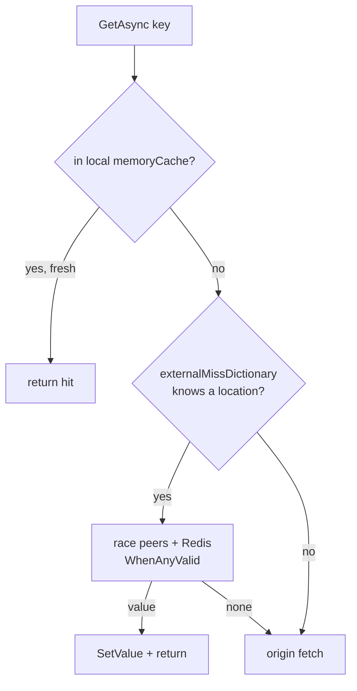
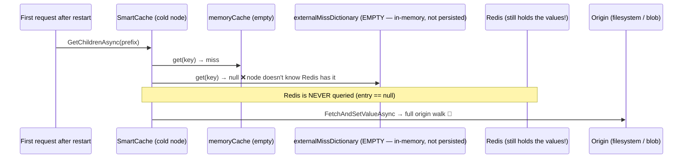

# SmartCache + Redis — can Redis improve cold start after a restart?

**Date:** 2026-07-23
**Author:** Dario Airoldi
**Status:** ℹ️ Analysis (informs upcoming Redis cold-start support)
**Component:** Learn.Web (server host) · Diginsight SmartCache `3.7.1.14` · `.Externalization.Redis`
**Related:** [overview.md](overview.md) · [01.smartcache-doesnt-coalesce.md](01.smartcache-doesnt-coalesce.md) · [02-loading-process-flow.md](02-loading-process-flow.md)

---

## 📑 Table of Contents

- [📝 The question and short answer](#-the-question-and-short-answer)
- [🎯 What "cold start" actually costs](#-what-cold-start-actually-costs)
- [🔍 How SmartCache resolves a lookup](#-how-smartcache-resolves-a-lookup)
- [✍️ How SmartCache writes (modes)](#️-how-smartcache-writes-modes)
- [🗄️ SmartCache + Redis: the passive-location model](#️-smartcache--redis-the-passive-location-model)
- [❓ Can Redis improve cold start?](#-can-redis-improve-cold-start)
- [🚀 Making Redis help cold start](#-making-redis-help-cold-start)
- [📎 Appendix — decompiled evidence](#-appendix--decompiled-evidence)

---

## 📝 The question and short answer

> When the site restarts (deploy, app-pool recycle, scale event, crash), can a configured **Redis**
> passive store make the cache **warm on cold start** — so the first requests don't pay the full
> origin walk?

**Short answer: no — not with SmartCache's Redis integration as it ships in `3.7.1.14`.** Redis holds
the serialized values across a restart, but a freshly-started node **never asks Redis for them**,
because the metadata that tells SmartCache "this key lives in Redis" (`externalMissDictionary`) is an
**in-memory** structure that is empty on startup and is not rebuilt from Redis. On a cold local miss
with an empty dictionary, SmartCache skips every passive location and goes straight to the origin.

This document proves that from the decompiled library and describes what it would take to make Redis
actually accelerate cold start — the work tracked as **"Redis cold-start support."**

---

## 🎯 What "cold start" actually costs

The dominant cold cost is **not** content bytes — it is the **navigation whole-tree walk**:

- `DynamicNavBuilder.GetIndexAsync()` and `WarmAllLevelsAsync()` perform a per-folder
  `ListChildrenAsync` **and a per-file `ReadHeadAsync`** (frontmatter read) for *every* article.
- Measured cost: **~3 minutes** serial on the current content set.
- The startup background warm-up in [Program.cs](../../../../../src/Learn.Web/Program.cs) hides most of
  it from users, but the walk is re-run **from the origin on every restart**.

So the value we want from Redis is: *persist the built navigation (index + every level) and the parsed
content, and reload it in one cheap read on startup instead of re-walking the origin.* The rest of this
document explains why the passive-location mechanism does not deliver that today.

---

## 🔍 How SmartCache resolves a lookup

`SmartCache.GetAsync` (decompiled from `Diginsight.SmartCache 3.7.1.14`) resolves a read in this order:

```csharp
valueEntry = memoryCache.Get<ValueEntry<T>>(key);     // 1. local in-memory tier
entry      = externalMissDictionary.Get(key);         // 2. "which OTHER locations hold this key?"

if (entry != null) {                                  //    only if a location is already KNOWN
    var locations = activeLocations(entry.Locations)  //    peers (HTTP/Service Bus) …
                      .Concat(passiveLocations.Values); //  … + passive locations (Redis)
    var result = await TaskUtils.WhenAnyValid(         //    race the known locations by latency
                     locations.Select(l => l.GetAsync<T>(key, minCreationDate, …)));
    if (result.HasValue) { SetValue(key, result); return result.Item; }
}

return await FetchAndSetValueAsync(activity);          // 3. ORIGIN fetch (filesystem / blob)
```

The decisive fact: **passive locations (Redis) are only consulted inside `if (entry != null)`** — that
is, only when `externalMissDictionary` *already* records that the key exists in some location. There is
**no read-through-by-key fallback**: if the dictionary has no entry for the key, Redis is never probed
and the code falls straight through to the origin fetch.



## ✍️ How SmartCache writes (modes)

`SetValue` always writes local memory, then propagates according to `SmartCacheMode`. The configured
mode is **only honored when a real passive location exists**; otherwise the library logs
*"SmartCacheMode downgraded to InMemory because no passive location is available"* and behaves as
single-instance.

| Mode | On write | Redis written? | Notes |
|---|---|---|---|
| **InMemory** | `NotifyMiss` broadcasts the value to peers | ❌ | Current runtime (no Redis configured) |
| **MixedPassive** ("hybrid") | small values → broadcast to peers; large values → `WriteToLocation` → Redis | ⚠️ large only | "hybrid miss" path |
| **PurePassive** | every value → `WriteToLocation` → Redis | ✅ | Redis is the shared value tier |

In every mode the **discovery** mechanism is the same in-memory `externalMissDictionary`, populated by
(a) this node's own `SetValue` and (b) **live broadcast notifications** from peers. Nothing repopulates
it from Redis.

---

## 🗄️ SmartCache + Redis: the passive-location model

- Redis is a **passive backing store**: `RedisCacheLocation : PassiveCacheLocation` with
  `StringGetAsync` / `StringSetAsync` over serialized value blobs. The envelopes used here
  (`NavIndexEnvelope`, `NavChildrenEnvelope`, `CachedContent`) already round-trip cleanly.
- A value reaches Redis via `WriteToLocation` (PurePassive, large MixedPassive values, or capacity
  eviction). It **persists across a process restart** — the bytes are still there.
- But the **key→location metadata** that would tell a node to *read* those bytes lives only in
  `externalMissDictionary` (an in-memory `ConcurrentDictionary`, see appendix). It is:
  - populated by runtime `NotifyMiss` broadcasts and local writes,
  - **never** persisted, and **never** reloaded from Redis on startup (no `SCAN`, no seed).

**Consequence:** Redis de-duplicates **staggered** and **cross-node** misses *while nodes are running*
(node B learns from node A's broadcast, then reads Redis instead of the origin). It does **not** survive
a restart, because the dictionary that makes Redis discoverable starts empty.

---

## ❓ Can Redis improve cold start?

**No — as currently designed.** On a fresh process every lookup finds an empty memory tier **and** an
empty `externalMissDictionary`, so `entry == null`, Redis is skipped, and the node re-walks the origin —
even though Redis still physically holds the built navigation and content.



| Scenario | Does Redis help? | Why |
|---|---|---|
| Staggered misses, one running node | ✅ | after the first write, the dictionary points at Redis |
| Cross-node, both nodes running | ✅ | node B learns the location from node A's broadcast |
| Capacity eviction on a live node | ✅ | evicted entry is written to Redis and the dictionary keeps the pointer |
| **Process restart / reset (cold start)** | ❌ | `externalMissDictionary` is empty and not rebuilt from Redis → Redis never consulted |

---

## 🚀 Making Redis help cold start

Because the blocker is *discovery*, not *storage*, cold-start acceleration needs the node to learn (or
bypass) the key→location metadata at startup. Two viable directions:

| Approach | Mechanism | Pros | Cons |
|---|---|---|---|
| **A. Redis cold-start support** (selected) | On startup, seed discovery from Redis — either repopulate `externalMissDictionary` from a persisted key index / `SCAN` (with `KeyPrefix`), or add a **read-through-by-key** probe of the passive location on a cold local miss | Reuses the existing Redis values; transparent to callers; benefits content **and** navigation | Touches the SmartCache layer; `SCAN` cost must be bounded; needs a freshness/version guard |
| **B. App-level nav snapshot** | Serialize the whole built navigation into one versioned blob (Redis or Blob) keyed by a content-version token; read it once on startup and seed SmartCache via `SetValue`; rebuild + rewrite on version mismatch | No library change; one cheap read replaces the 3-min walk | Bespoke; only covers navigation unless extended to content |

**Selected direction:** **A — add cold-start support to the Redis cache.** On startup the passive
Redis location becomes *discoverable* (seed `externalMissDictionary` from a persisted index, or probe
Redis by key on a cold miss), guarded by a content-version token so stale entries are ignored after a
content change. This reuses the values SmartCache already writes to Redis and accelerates both the
navigation walk and content reads without a second, bespoke cache surface.

A complementary, independent win regardless of Redis: **make the cold walk cheaper** — parallelize the
tree walk and/or cache `ReadHeadAsync` frontmatter by `path + mtime` — so even a genuine rebuild is
seconds, not minutes.

---

## 📎 Appendix — decompiled evidence

**`externalMissDictionary` is in-memory only** (`Diginsight.SmartCache.SmartCache+ExternalMissDictionary`):

```csharp
private sealed class ExternalMissDictionary
{
    public sealed record Entry(DateTimeOffset Timestamp, IEnumerable<string> Locations);
    private readonly ConcurrentDictionary<object, Entry> underlying = new();   // ← not persisted
    public Entry? Get(object key) => underlying.TryGetValue(key, out var e) ? e : null;
    public void Add(object key, DateTimeOffset ts, string location) { /* … in-memory merge … */ }
}
// field: private readonly ExternalMissDictionary externalMissDictionary = new();
```

**Passive locations are only read when a location is already known** (`GetAsync`):

```csharp
valueEntry = memoryCache.Get<ValueEntry<T>>(keyHolder.Payload);
entry      = externalMissDictionary.Get(keyHolder.Payload);
…
if ((object)entry != null)
{
    var locations = ((IEnumerable<CacheLocation>)await companion.GetActiveLocationsAsync(locationIds))
                        .Concat(passiveLocations.Values)          // ← Redis only reachable here
                        .ToDictionary(x => x.Id);
    … WhenAnyValid(…) …
}
return await FetchAndSetValueAsync(activity);                      // ← taken when entry == null (cold)
```

**Write side** (`SetValue`) — mode is downgraded without a passive location, and only PurePassive /
large-MixedPassive values reach Redis:

```csharp
if (passiveLocations.Count > 1)  smartCacheMode = dynamicCoreOptions?.Mode ?? coreOptions.Mode;
else { logger.LogWarning("SmartCacheMode downgraded to InMemory because no passive location is available");
       smartCacheMode = SmartCacheMode.InMemory; }
…
switch (smartCacheMode) {
    case SmartCacheMode.InMemory:     NotifyMiss(keyHolder, creationDate, valueType, value, …); break;
    case SmartCacheMode.MixedPassive: if (IsSmallValue(…)) { NotifyMiss(…, _ => true); break; }
                                      goto case SmartCacheMode.PurePassive;
    case SmartCacheMode.PurePassive:  foreach (var loc in passiveLocations.Values)
                                          WriteToLocation(loc, keyHolder, valueEntry, finalAbsExpiration);
                                      break;
}
```

**Source:** `~/.nuget/packages/diginsight.smartcache/3.7.1.14/lib/net9.0/Diginsight.SmartCache.dll` and
`…/diginsight.smartcache.externalization.redis/3.7.1.14/…/Diginsight.SmartCache.Externalization.Redis.dll`,
decompiled with `ilspycmd` on 2026-07-23.
