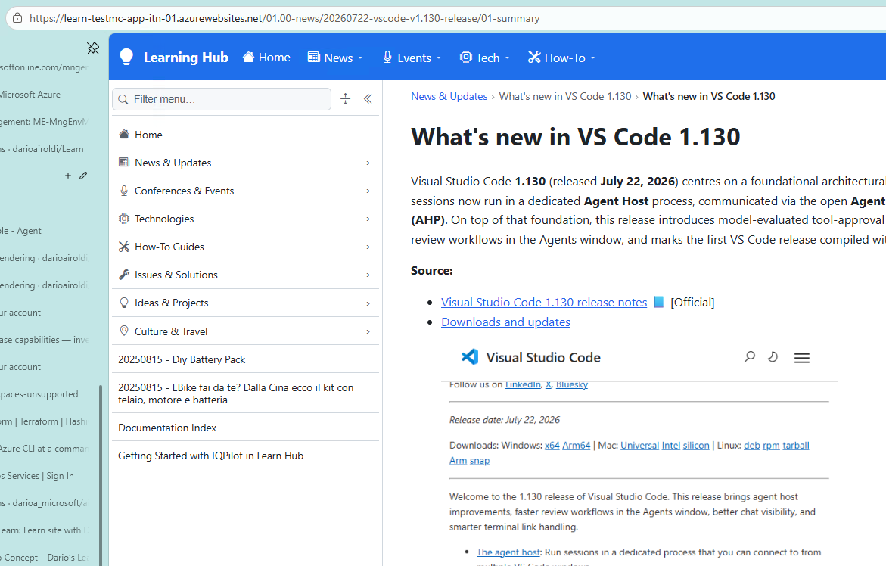
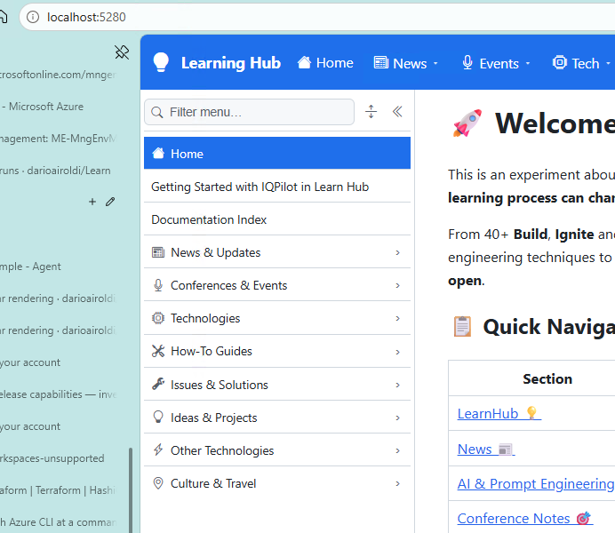

# Azure navigation shows stale, misplaced menu items — content-deploy allowlist drift

**Date reported:** 2026-07-26
**Reporter:** Dario Airoldi
**Status:** ✅ Resolved (code) — workflow staging corrected and dead tooling removed; **pending one manual workflow run** to reset and re-upload storage
**Severity:** Medium (live-site navigation correctness + recurring deployment-reliability defect)
**Component:** `.github/workflows/deploy-learninghub.yml` (content deploy) · `Learn.Web` runtime navigation (`DynamicNavBuilder`) · Azure Blob Storage `digitoolstestmcstitn01/learn`
**Framework:** GitHub Actions (self-hosted runner, PowerShell 7) · Azure CLI (`az storage`) · .NET 10 / Blazor Web App (Markdig) for on-demand rendering

---

## 📑 Table of contents

- [📝 Description](#-description)
- [🔍 Context information](#-context-information)
- [🔬 Analysis](#-analysis)
- [🔄 Reproduction steps](#-reproduction-steps)
- [✅ Solution implemented](#-solution-implemented)
- [📚 Additional information](#-additional-information)
- [✔️ Resolution status](#️-resolution-status)
- [🎓 Lessons learned](#-lessons-learned)
- [📎 Appendix](#-appendix)
- [📚 References](#-references)

---

## 📝 Description

The navigation menu on the **live Azure site** (`learn-testmc-app-itn-01.azurewebsites.net`) showed four
items that do not appear — or appear differently — on **localhost**:

- `20250815 - Diy Battery Pack`
- `20250815 - EBike fai da te? Dalla Cina ecco il kit con telaio, motore e batteria`
- `Documentation Index`
- `Getting Started with IQPilot in Learn Hub`

On Azure these four were rendered as **top-level menu entries at the bottom** of the sidebar. On localhost
the same content is organized correctly: *Getting Started* and *Documentation Index* sit at the **top**
(right after **Home**), and the two DIY articles are **nested inside an "Other Technologies" section** that
was **missing entirely** from the Azure menu.

The reporter's questions were: *"are they some old data that is not cleaned up?"* and *"can you help me fix
the CICD?"* — both answered below (yes, stale data caused by a drifted deploy script; and yes, fixed).

**Symptom (current, wrong — Azure):**



**Expected (correct — localhost):**



**Impact points:**

- Public site navigation does not reflect the current content structure (correctness / trust).
- The defect is **systemic**: a drift-prone allowlist would keep re-introducing this every time content is
  reorganized, so stale entries would recur.

---

## 🔍 Context information

The Learning Hub serves the **same Markdown source** through two different content sources, which is why the
two environments diverged:

| Environment | Content source | How navigation is built |
|---|---|---|
| **localhost** | Repo filesystem (`Content:Source = FileSystem`) | `DynamicNavBuilder` enumerates the live folder hierarchy on demand |
| **Azure** | Blob container `digitoolstestmcstitn01/learn` (`Content:Source = Blob`) | Same `DynamicNavBuilder`, but over **whatever blobs the deploy workflow uploaded** |

Because the app renders **markdown-first** (no build step, navigation built at runtime), the Azure menu is a
faithful mirror of the **blob container contents**. If the container holds the wrong set of blobs, the menu
is wrong — the rendering logic is identical in both environments.

**Deployment topology:**

- `.github/workflows/deploy-learninghub.yml` — stages the Markdown source, **resets** the container
  (`az storage blob delete-batch`), then **uploads** it (`az storage blob upload-batch`) and flushes the app
  cache. This is the workflow that populates Azure content.
- `.github/workflows/deploy-learnweb.yml` — deploys the app code only (unrelated to this issue).

**Relevant navigation rules** (`src/Learn.Web.Shared/Navigation/NavRules.cs` → `SortKey`):

| Sort group | Matches | Ordering |
|---|---|---|
| 0 | Numeric prefix (`00.00-`, `01.00-`, `85.00-`) | Ascending |
| 1 | Date prefix (`20250815-…`) | Newest first |
| 2 | No prefix (`documentation-index.md`) | Alphabetical (falls to the **bottom**) |

---

## 🔬 Analysis

### Root cause

The *Stage Markdown content* step of `deploy-learninghub.yml` collected content from a **hard-coded
allowlist** of folders and files. After the content was reorganized in the repo, that allowlist was never
updated, so it **drifted** out of sync with reality:

| Workflow allowlist (stale) | Repo actually has (current) | Effect on the Azure menu |
|---|---|---|
| `20250815-diy-battery-pack`, `20250815-diy-ebike` listed as **root** folders | Both moved under `85.00-other/` | Uploaded (from a prior run) as **date-prefixed top-level items** → sort group 1 → bottom of menu |
| Root files `getting-started.md`, `documentation-index.md` | Renamed `00.00-getting-started.md`, `00.01-documentation-index.md` | Old names lost their `00.xx` numeric prefix → sort group 2 → **bottom** instead of top |
| *(absent)* `85.00-other` | Exists, with `metadata.yml` (`label: Other Technologies`) | Never staged → **"Other Technologies" section missing** from Azure |

Two failure modes compounded:

1. **Stale blobs not cleaned up** — content uploaded under the old flat layout lingered in storage. (The
   workflow *does* reset the container before upload, but the allowlist would never re-create the correct
   layout, so the menu stayed wrong regardless.)
2. **Wrong sort position** — because the old names lack the `00.xx`/section prefixes, `SortKey` places them in
   the trailing groups, producing the "items dumped at the bottom" appearance.

### Why localhost was always correct

localhost reads the **live filesystem**, so it always saw `85.00-other/` (→ "Other Technologies") and the
`00.00-`/`00.01-` prefixed root pages (→ top of menu). Only the **blob-populating workflow** was stale, so the
divergence was entirely a deployment-staging defect — not an app or rendering bug.

### Impact assessment

- **Scope:** cosmetic-but-visible navigation defect on the public site; no content loss, no data corruption.
- **Recurrence risk (the real problem):** an allowlist that must be hand-edited on every content
  reorganization is guaranteed to drift again. This is the class of defect worth fixing structurally.

---

## 🔄 Reproduction steps

1. Reorganize content in the repo (e.g., move `20250815-diy-battery-pack/` under `85.00-other/`; rename
   `getting-started.md` → `00.00-getting-started.md`).
2. Do **not** update the allowlist in `deploy-learninghub.yml`.
3. Trigger the content-deploy workflow (or observe the last-deployed state).
4. Open the Azure site and compare its sidebar with localhost.

**Observed:** DIY articles + `Documentation Index` + `Getting Started` appear as top-level entries at the
bottom; "Other Technologies" is absent.
**Expected:** menu matches localhost (see `images/001.02-ok-menu.png`).

**Affected code locations:**

- `.github/workflows/deploy-learninghub.yml` → *Stage Markdown content* step (the hard-coded `$roots` /
  `$rootFiles` lists).
- `src/Learn.Web/Navigation/DynamicNavBuilder.cs` → folder enumeration and `SortKey` ordering (correct — no
  change needed; documents the resulting order).
- `src/Learn.Web.Shared/Navigation/NavRules.cs` → `SortKey`, `IsExcludedName` (correct — mirrored by the fix).
- Storage: `digitoolstestmcstitn01`, container `learn`.

---

## ✅ Solution implemented

### 1. Replace the drift-prone allowlist with robust enumeration

The staging step now **enumerates** every top-level folder and Markdown page and applies a **deny-list** of
infrastructure directories — mirroring the exclusions the app's own navigation builder already uses
(`.`/`_`-prefixed and infra folders). New or renamed content now deploys automatically and can never drift.

**Before (hard-coded allowlist — buggy):**

```powershell
# Content roots: folders that hold only site content (.md/.qmd + images).
$roots = @(
  "01.00-news", "02.00-events", "03.00-tech", "04.00-howto", "05.00-issues",
  "06.00-idea", "90.00-travel", "99.00-temp",
  "20250815-diy-battery-pack", "20250815-diy-ebike"
)
foreach ($r in $roots) {
  if (Test-Path $r) { Copy-Item -Path $r -Destination $stage -Recurse -Force }
}

# Root-level content pages.
$rootFiles = @("README.md", "getting-started.md", "documentation-index.md")
foreach ($f in $rootFiles) {
  if (Test-Path $f) { Copy-Item -Path $f -Destination $stage -Force }
}
```

**After (enumeration + deny-list — fixed):**

```powershell
# Content is every top-level folder and Markdown page at the repo root EXCEPT app code,
# deployment infrastructure, and tooling. Enumerating (deny-list) instead of maintaining an
# allow-list means new or renamed content folders (e.g. 85.00-other/, or renamed root pages)
# deploy automatically and can never drift out of sync with the site.
$excludeDirs = @("src", "deploy", "scripts", "docs", "AzuriteConfig", "bin", "obj", "node_modules")

# Top-level content folders: skip infra dirs and any dot/underscore-prefixed working folder.
Get-ChildItem -Directory | Where-Object {
  $_.Name -notin $excludeDirs -and $_.Name -notlike ".*" -and $_.Name -notlike "_*"
} | ForEach-Object { Copy-Item -LiteralPath $_.FullName -Destination $stage -Recurse -Force }

# Top-level content pages (Markdown only; other root files are config/build/licence, not content).
Get-ChildItem -File | Where-Object { $_.Extension -in ".md", ".qmd" } |
  ForEach-Object { Copy-Item -LiteralPath $_.FullName -Destination $stage -Force }
```

The existing **reset-before-upload** logic (`az storage blob delete-batch` → `az storage blob upload-batch`)
was already present and correct; combined with the corrected staging it now produces a **clean mirror** of the
repo.

### 2. Remove dead legacy Quarto navigation tooling

Five obsolete files (a validator for the **removed** `_quarto.yml`, its companion filter, and their generated
output — all carrying a hard-coded `e:\…` path that didn't even match the workspace) were deleted:

- `scripts/_nav-verify.ps1`
- `scripts/_nav-filter.ps1`
- `scripts/_nav-dangling.txt`
- `scripts/_nav-missing.txt`
- `scripts/_nav-missing-filtered.txt`

### Solution features

- ✅ Deployment staging can no longer drift from the repo (structural fix, not a one-off patch).
- ✅ Storage becomes a faithful mirror of content; the reset step evicts any stale blobs.
- ✅ Deploy exclusions mirror the app's own nav exclusions (single source of truth for "what is content").

---

## 📚 Additional information

### Validation

The new selection logic was **dry-run** against the repo root (read-only), confirming it stages exactly the
expected set:

```text
== Folders that WOULD be staged ==
01.00-news, 02.00-events, 03.00-tech, 04.00-howto, 05.00-issues,
06.00-idea, 85.00-other, 90.00-travel, 99.00-temp
== Root pages that WOULD be staged ==
00.00-getting-started.md, 00.01-documentation-index.md, README.md
```

Feeding that into `DynamicNavBuilder`'s ordering yields: **Home → Getting Started → Documentation Index →
News & Updates → Conferences & Events → Technologies → How-To Guides → Issues & Solutions → Ideas & Projects →
Other Technologies → Culture & Travel** — matching `images/001.02-ok-menu.png` exactly. (`99.00-temp` is
staged but hidden from the menu by the app's `RootInfra` rule.)

### Deployment considerations

- The workflow ignores `.github/**` in its `paths-ignore`, so **editing the workflow alone does not trigger a
  deploy**. Trigger it manually via **Actions → "Deploy Learning Hub content to storage" → Run workflow**, or
  push any content change.
- `README.md` is uploaded but not shown as its own menu item (the app treats `readme`/`index` as folder
  representatives; the site root uses the injected **Home** link instead).

### Performance impact

None. The change is confined to the CI staging step; the reset-and-upload volume is unchanged and the app's
runtime rendering path is untouched.

---

## ✔️ Resolution status

**Status:** ✅ Code resolved — awaiting one manual deploy run to refresh storage.

**Verification checklist:**

- [x] Root cause identified (allowlist drift in `deploy-learninghub.yml`).
- [x] Staging step replaced with enumeration + deny-list.
- [x] New selection dry-run verified against the repo (correct folder/page set).
- [x] Dead legacy Quarto nav tooling removed.
- [ ] Run `deploy-learninghub.yml` (workflow_dispatch) to reset + re-upload storage.
- [ ] Confirm the Azure sidebar matches `images/001.02-ok-menu.png` (Getting Started/Documentation Index at
  top; "Other Technologies" present; no bottom stragglers).
- [ ] Confirm the app cache flushed (or hit `/_cache/invalidate`).

**Follow-up actions:**

- [ ] Optional: update `scripts/README.md`, which still documents the already-removed `generate-navigation.ps1`.
- [ ] Optional: consider excluding `99.00-temp/` from staging to keep temp pages out of storage entirely
  (currently staged but hidden from nav).

---

## 🎓 Lessons learned

**What went wrong:**

- A **hard-coded allowlist** in CI was treated as static, but content structure evolves. Allowlists that must
  be hand-maintained on every reorganization **will** drift — this is a "when", not "if".
- The deploy definition of "what is content" diverged from the **app's** definition, so the two disagreed
  silently.

**What went right:**

- The workflow already **reset the container before upload**, so the fix didn't need new cleanup machinery —
  only correct staging.
- Because rendering is identical across environments, **localhost was a reliable oracle** for the expected
  result, making the divergence easy to reason about.

**Improvements for the future:**

- Prefer **deny-lists / enumeration** over allow-lists for "collect all content" steps, and align them with
  the application's own exclusion rules so there is a single source of truth.
- When reorganizing content folders, grep CI/tooling for the **old paths/names** as part of the change.

---

## 📎 Appendix

### Evidence

| State | Screenshot | Notes |
|---|---|---|
| Current (wrong) | `images/001.01-dirty-menu.png` | Azure: four stale/misplaced items at the bottom; no "Other Technologies" |
| Expected (correct) | `images/001.02-ok-menu.png` | localhost: Getting Started/Documentation Index at top; "Other Technologies" present |

### Files changed

- `.github/workflows/deploy-learninghub.yml` — *Stage Markdown content* step rewritten (enumeration + deny-list).
- Deleted: `scripts/_nav-verify.ps1`, `scripts/_nav-filter.ps1`, `scripts/_nav-dangling.txt`,
  `scripts/_nav-missing.txt`, `scripts/_nav-missing-filtered.txt`.

### Key references (source of truth for the resulting order)

- `src/Learn.Web/Navigation/DynamicNavBuilder.cs` — on-demand level building, section vs. collapsed-link
  classification, `RootInfra` (temp exclusion).
- `src/Learn.Web.Shared/Navigation/NavRules.cs` — `SortKey` (numeric → date → alpha), `IsExcludedName`.
- `85.00-other/metadata.yml` — `label: Other Technologies`.

---

## 📚 References

- Workflow: `.github/workflows/deploy-learninghub.yml`
- App navigation: `src/Learn.Web/Navigation/DynamicNavBuilder.cs`, `src/Learn.Web.Shared/Navigation/NavRules.cs`
- Storage account: `digitoolstestmcstitn01`, container `learn`
- Related recap (markdown-first architecture): `src/docs/90. Issues/202607/20270711.02-progressive-build/overview.md`
