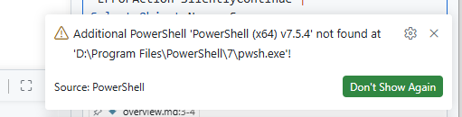
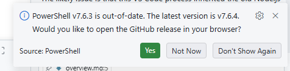
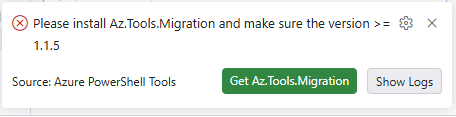

# Issue report

**Issue title:** VS Code startup configuration drift across machines

**Date reported:** 2026-08-04  
**Reporter:** Dario Airoldi  
**Status:** Resolved

**Severity:** Medium  
**Component:** VS Code startup configuration and extension runtime dependencies  
**Framework:** Windows + VS Code 1.131.0 + PowerShell 5.1 and 7.x

## 📋 Table of contents

- [📝 Description](#-description)
- [🔍 Context information](#-context-information)
- [🔬 Analysis](#-analysis)
- [🔄 Reproduction steps](#-reproduction-steps)
- [✅ Solution implemented](#-solution-implemented)
- [📚 Additional information](#-additional-information)
- [✔️ Resolution status](#️-resolution-status)
- [🎓 Lessons learned](#-lessons-learned)
- [📎 Appendix](#-appendix)

## 📝 Description

VS Code showed multiple startup warnings on the same machine after configuration and profile drift across sessions. The warnings appeared to be unrelated at first glance, but they were all caused by host/runtime mismatches and machine-specific absolute paths that had drifted into synchronized or shared settings.

Observed warning families:  

- Azure Logic Apps extension warning about Node.js version being below required major version.  
  
- PowerShell extension warning about an additional executable configured on `D:\` even though the machine has only `C:\`.

- PowerShell extension warning about being out of date.

- Azure PowerShell Tools warning requiring `Az.Tools.Migration >= 1.1.5`.

User impact:

- Startup noise and reduced trust in local toolchain readiness.
- Risk of cross-machine breakage because absolute executable paths were portable only on one host.
- Potential onboarding friction for future environments due to hidden host-specific dependencies.

## 🔍 Context information

### Environment snapshot

| Field | Value |
|---|---|
| OS | Windows |
| VS Code | 1.131.0 (64-bit) |
| PowerShell extension | 2025.4.0 |
| `pwsh` system path | `C:\Program Files\PowerShell\7\pwsh.exe` |
| `pwsh` system version | 7.6.3 |
| `pwsh` user alias version | 7.6.4 |

### Conversation evidence summary

| Case | Key signal | Evidence |
|---|---|---|
| Logic Apps runtime mismatch | Extension read Node.js 18 from old profile path | Logic Apps output log reported `NodeJs local version: 18.20.8` and dependency feed requiring Node 20 |
| Logic Apps dependency update failure | Permission failure against obsolete profile root | Log reported `EPERM: operation not permitted, chmod` on old `.azurelogicapps` dependency folder |
| PowerShell additional exe not found | Workspace setting pointed to non-existent D drive path | PowerShell extension log reported additional PowerShell not found at `D:\Program Files\PowerShell\7\pwsh.exe` |
| Az.Tools.Migration warning | Module found in `pwsh` but missing in Windows PowerShell host | `pwsh` found module version 11.0.2 while `powershell.exe` initially reported not found |

### Affected workspace configuration

- Terminal profile settings in [/.vscode/settings.json](../../../../../.vscode/settings.json).
- Issue context and screenshots in [src/docs/90. Issues/202608/20260803.01-vscode-config-fix/overview.md](overview.md).

## 🔬 Analysis

### Root causes

1. Machine-specific absolute executable paths were committed to workspace settings.
2. Roaming and shared settings increased the chance of stale host-specific paths surviving across machines.
3. Different extensions validated dependencies against different PowerShell hosts:
- `pwsh` (PowerShell 7)
- `powershell.exe` (Windows PowerShell 5.1)
4. Runtime dependency folders were pinned to an obsolete user profile root.

### Impact assessment

| Dimension | Impact |
|---|---|
| Reliability | Medium: startup checks repeatedly failed despite healthy system runtime |
| Portability | High: absolute host paths were not portable across devices |
| Developer experience | Medium: recurring warnings obscured real issues |
| Security posture | Low: no credential leak, but stale profile references increased maintenance risk |

### Affected workflows

- Opening VS Code and waiting for extension startup checks.
- Running Logic Apps local dependency validation.
- Starting PowerShell extension host discovery.
- Running Azure PowerShell migration tooling checks.

## 🔄 Reproduction steps

1. Open the workspace on a machine that does not have `D:\Program Files\PowerShell\7\pwsh.exe` configured. (✅ done)
2. Keep a workspace setting that pins `terminal.integrated.profiles.windows.PowerShell.path` to `D:\...`. (✅ done)
3. Keep PowerShell extension additional exe mapping pinned to the same missing path. (✅ done)
4. Open VS Code and wait for startup extension checks. (✅ done)
5. Observe warning notification for missing additional PowerShell executable. (✅ done)
6. Keep Logic Apps runtime dependency settings pinned to an obsolete profile root with Node 18. (✅ done)
7. Observe Logic Apps warning and dependency update failure against stale path. (✅ done)
8. Ensure `Az.Tools.Migration` exists only in `pwsh` and not in `powershell.exe` profile. (✅ done)
9. Observe Azure PowerShell Tools migration-module warning. (✅ done)

## ✅ Solution implemented

### Fix overview

The implemented fix removed host-specific drift, restored portable discovery-based configuration, and satisfied extension-specific runtime/module requirements in the correct host.

### Workspace fixes

- Replaced explicit PowerShell executable path with profile source discovery in [/.vscode/settings.json](../../../../../.vscode/settings.json).
- Removed extension-specific PowerShell executable/version pinning from workspace scope.

### User settings fixes

- Repointed Logic Apps managed runtime dependency paths from obsolete profile root to current profile root.
- Added sync ignore entries for machine-specific PowerShell keys to prevent cross-device reintroduction.
- Disabled PowerShell update prompt after ensuring a newer user-scope runtime exists.

### Runtime and module fixes

- Installed user-scope PowerShell 7.6.4 (available via WindowsApps alias).
- Installed `Az.Tools.Migration` in Windows PowerShell 5.1 current-user module scope.

## 📚 Additional information

### Testing recommendations

1. Reload VS Code window to force extension dependency re-check. (🟡 todo)
2. Re-open this workspace and validate that no startup warnings reappear. (🟡 todo)
3. Confirm `powershell.exe` and `pwsh` both resolve `Az.Tools.Migration`. (✅ done)
4. Confirm Logic Apps extension uses current profile dependency root. (🟡 todo)

### Migration considerations

- Avoid committing executable absolute paths in workspace settings unless the repository is intentionally single-host.
- Prefer discovery keys (`source`) over explicit binary paths for shells.
- Treat extension host differences (PowerShell 5.1 vs 7.x) as independent dependency surfaces.

### Performance impact

- Negligible runtime overhead.
- Positive startup experience by removing repeated warning prompts.

## ✔️ Resolution status

**Current status:** Resolved with pending post-reload validation

### Verification checklist

- Logic Apps stale profile path replaced in user settings. (✅ done)
- Workspace PowerShell path no longer points to `D:\`. (✅ done)
- PowerShell 7.6.4 user-scope runtime installed. (✅ done)
- `Az.Tools.Migration` visible in Windows PowerShell 5.1. (✅ done)
- VS Code post-reload warning-free startup confirmed. (🟡 todo)

### Follow-up actions

1. Perform one manual `Developer: Reload Window` verification pass. (📌 next steps)
2. Keep machine-specific settings in sync ignore list where appropriate. (📌 next steps)
3. Periodically audit workspace settings for absolute host paths. (📌 next steps)

## 🎓 Lessons learned

### What went wrong

- Host-specific paths were allowed into a shareable workspace settings file.
- Dependency assumptions were made for `pwsh` only, while one extension validated against `powershell.exe`.

### What went right

- Logs quickly exposed each extension host and dependency source.
- Fixes were incremental, testable, and reversible.
- The final state balances portability and local productivity.

### Improvements for future prevention

- Add lightweight lint or review checks for obvious absolute path patterns in workspace settings.
- Document host-specific dependency expectations for critical extensions.
- Prefer machine-local user settings or environment discovery for executable paths.

## 📎 Appendix

### Relevant artifacts

- Conversation screenshots and scenario index in [src/docs/90. Issues/202608/20260803.01-vscode-config-fix/overview.md](overview.md).
- Workspace PowerShell profile configuration in [/.vscode/settings.json](../../../../../.vscode/settings.json).

### Reference links

- **[PowerShell extension settings](https://learn.microsoft.com/powershell/scripting/dev-cross-plat/vscode/using-vscode?view=powershell-7.5)** 📘 [Official]  
Describes PowerShell extension host behavior and VS Code integration.

- **[Install-Module reference](https://learn.microsoft.com/powershell/module/powershellget/install-module)** 📘 [Official]  
Defines module installation scopes and version management for PowerShell modules.

- **[VS Code settings profiles and settings](https://code.visualstudio.com/docs/getstarted/settings)** 📘 [Official]  
Explains workspace and user settings scope and portability implications.

<!--
validations:
  grammar: {status: "not_run", last_run: null}
  readability: {status: "not_run", last_run: null}

article_metadata:
  filename: "20260804-vscode-startup-configuration-analysis.md"
  created: "2026-08-04"
  last_updated: "2026-08-04"
  version: "0.1"
  status: "resolved"
  issue_type: "configuration"
-->
