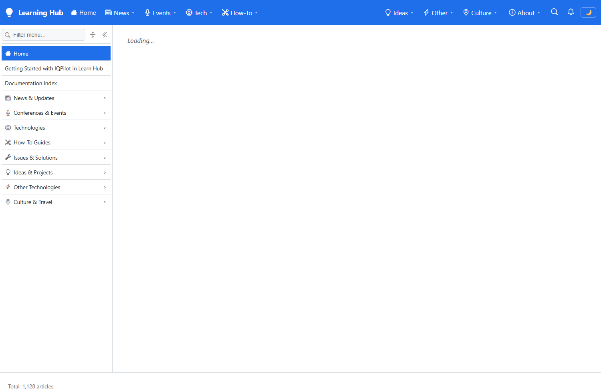

# Validation sequence — navigation article counter

This run validates that the site's article counter is **server-authoritative and monotonic**: it reaches the same exact total on every load, holds that value unchanged while the whole tree is expanded, updates live when an article is added or removed without a page reload, and never displays `0` or a partially-summed total at any point. A value that is not yet complete is rendered as a labelled lower bound (`≥ N`) rather than as a total.

## Environment

| Item | Value |
|---|---|
| URL | `https://localhost:7280/` |
| Build | `dotnet build src/Learn.Web/Learn.Web.csproj` → Build succeeded, 0 Errors |
| Server | visible foreground console (`dotnet run --launch-profile https`) |
| Browser | visible Microsoft Edge window (headed, 1500×980) |
| Date | 2026-08-07 |
| Content baseline | 1,128 articles (8 root sections totalling 1,126 + 2 standalone root articles) |

## Sequence and results

| # | Precondition | Action | Expected | Observed | Result |
|---|---|---|---|---|---|
| 1 | Server warm, index settled | Load `/` and sample the footer until it stops changing | A single exact total; intermediate values labelled `≥`; never `0` | `≥1126` → `1128` | ✅ PASS |
| 2 | Home loaded, footer `1,128`, 0 sections open | Click **Expand all**, sample the footer 30× over ~10 s | Total stays exactly `1,128` for every sample | 74 sections opened; all 30 samples `1128` | ✅ PASS |
| 3 | Tree fully expanded, footer `1,128` | `POST /_test/article?folder=05.00-issues&name=zz-browser-probe` | Footer becomes `1,129` live, no reload | `1128 → 1129` | ✅ PASS |
| 4 | Article added, footer `1,129` | Hover the **Issues & Solutions** section | Section line shows `Issues & Solutions: 4 articles` | `Issues & Solutions: 4 articles Total: 1,129 articles` | ✅ PASS |
| 5 | Footer `1,129` | `DELETE /_test/article?folder=05.00-issues&name=zz-browser-probe` | Footer returns to `1,128` live, no reload | `1129 → 1128` | ✅ PASS |
| 6 | Content back at baseline | Reload the page and sample the footer | Never `0`; settles on `1,128` | `≥1126` → `1128` | ✅ PASS |
| 7 | Whole run | Watch console + network | No JS errors, no unexpected 4xx/5xx | none (only the pre-existing optional `_content-raw/index.md` probe) | ✅ PASS |

**Browser scenarios: 16 assertions × 3 consecutive runs — 16 PASS, 0 FAIL each time.**

### Supporting API-level checks

Two suites run against the same server, all PASS:

| Suite | Assertions | What it covers |
|---|---|---|
| `test-nav-metrics.ps1` | **29 PASS / 0 FAIL** | Cold-start convergence (0 dirty, all 207 folders `Complete`); every root count served by `/_nav/children` equals its index cell; add → +1 on folder and root; remove → back to baseline; burst of 3 adds + 3 removes with no drift |
| `test-nav-consistency.ps1` | **96 PASS / 0 FAIL** | After **every** mutation asserts `root cell == Σ(child section cells) + standalone root articles` **and** `level payload == cells`. Covers 10 add/remove cycles, an add at a 3-level-deep path, and a 5-article burst spread across two folders |

### Cold-start climb (index sampled every 6 s from an empty index)

```text
cells= 78 root= 259 cov=Partial dirty=29
cells= 99 root= 306 cov=Partial dirty= 1
cells=131 root= 350 cov=Partial dirty=13
cells=162 root= 521 cov=Partial dirty= 9
cells=188 root= 790 cov=Partial dirty= 8
cells=205 root=1046 cov=Partial dirty= 7
cells=205 root=1124 cov=Partial dirty= 1
cells=207 root=1128 cov=Complete dirty= 0
```

Monotonically non-decreasing, `Partial` (rendered `≥ N`) throughout, `Complete` only at the end. The counter can never dip, and a lower bound is never presented as a total.

## Evidence

| Step | Screenshot |
|---|---|
| **1 — Simple load.** After WASM boots and the metadata hub connects, the footer settles on the exact site total. The tree is collapsed, so this value comes entirely from the server, not from the rendered nodes. |  |
| **2 — Expand all.** 74 sections are open. The footer still reads `Total: 1,128 articles` — identical to step 1. Previously this was the scenario where the counter dropped toward zero and climbed back as each level reported. |  |
| **3 — Live add.** An article is created under `05.00-issues` through the test endpoint. Without any reload the footer moves to `Total: 1,129 articles`, pushed over the nav hub after the debounced drain. |  |
| **4 — Section line follows.** Hovering *Issues & Solutions* shows `Issues & Solutions: 4 articles` — the folder's own recomputed count, not a client-side sum of the rendered children. |  |
| **5 — Live remove.** Deleting the article returns the footer to `Total: 1,128 articles`, again with no reload. Because the fold is a full recompute rather than a delta, removal needs no inverse operation. |  |
| **6 — Reload.** After the add/remove churn, a full reload settles on the same `1,128`. The counter never passes through `0`; the only intermediate value is the labelled lower bound `≥ 1,126`. |  |

## Defects found and fixed during this validation

Four real defects were found by these suites and fixed before the final run:

| # | Symptom | Cause | Fix |
|---|---|---|---|
| 1 | Folders stayed `Partial` forever after a cold start | A parent folded while a child was still undiscovered, then **settled** with a lower bound and was never revisited | Settle only on a `Complete` fold; an incomplete fold stays dirty for the next pass |
| 2 | A folder's count and the site total disagreed (`05.00-issues` 4 vs root 1,128) | A node whose value changed in a later drain did not make its ancestors suspect | On a value change, stamp every ancestor (`StampAncestors`) |
| 3 | A fold occasionally recounted a level cached before the change | Nav levels were evicted *after* folding, not before | `PublishChangeAsync` evicts levels before stamping |
| 4 | Footer total intermittently missed a live update while the tree was fully expanded | The site-root delta was only sent when it changed, and was applied after an `await` that queued behind an 80-section re-render | Always include the site-root cell in every push; apply it before any `await` |

## Notes

- **`≥ 1,126` is expected, not a defect.** Before the hub delivers the site-root aggregate, the client can only sum the eight root *sections* (1,126). That sum provably excludes the two standalone top-level articles, so it is rendered as a lower bound (`≥`) and is replaced by the authoritative `1,128` as soon as the push arrives. The value is monotonic and is never presented as a total.
- **A restart briefly shows the previous run's value.** The index is seeded from the snapshot and every cell is marked dirty, so the footer opens on the last known total and is corrected once the rescan settles. This was observed live: a snapshot written while a probe article existed made the footer open on `1,129`, which corrected to `1,128` after the rescan — never through `0`. That is the intended behavior.
- The `/_test/article` endpoints used in steps 3–5, and the `/_nav/metrics` diagnostics dump, are mapped only when `Testing:ContentMutationEnabled` is `true`. The flag was removed from `appsettings.Development.json` after this run and the routes were verified to be unmapped (`/_nav/metrics` returns the Blazor fallback HTML instead of JSON; `POST /_test/article` no longer creates content).
- The only failing network request in the run is `GET /_content-raw/index.md` → 404. It is a pre-existing optional probe by the home page and is unrelated to this change.
- The footer formats the number with the browser's culture (`1,128` or `1.128`), so the test parser strips non-digits rather than assuming a separator.
- Test scripts: `.copilot/temp/navcounts/test-nav-metrics.ps1`, `.copilot/temp/navcounts/test-nav-consistency.ps1` (API) and `.copilot/temp/pwtest/test-nav-ui.mjs` (browser).
