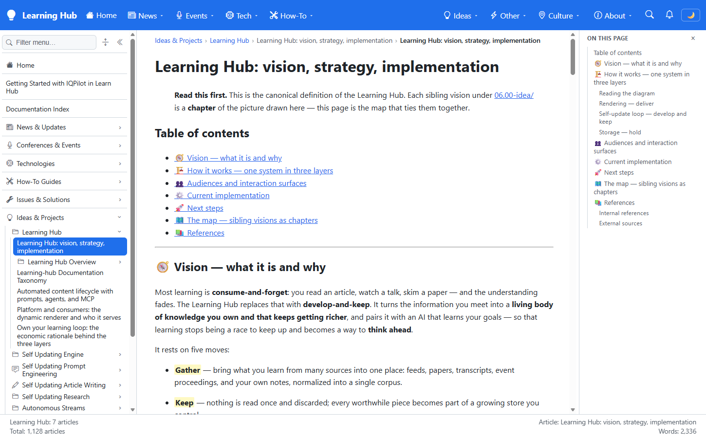

# Validation sequence — canonical Learning Hub route

This run validates that the content deployment removes blobs left behind by folder renames, rebuilds navigation from the current storage hierarchy, and resolves the canonical Learning Hub article at its `00.00-learning-hub` route.

## 🌐 Environment

| Item | Value |
|---|---|
| URL | `https://learn-testmc-app-itn-01.azurewebsites.net/` |
| Workflow validation | YAML diagnostics: no errors; command assertions: PASS; `git diff --check`: PASS |
| Content source | Azure Blob Storage container `learn` |
| Browser | Visible Microsoft Edge window, headed Playwright, 1450x900 |
| Date | August 12, 2026 |

## ✅ Sequence and results

| # | Precondition | Action | Expected | Observed | Result |
|---|---|---|---|---|---|
| 1 | Production contains content from before and after the folder rename | Compare active blobs under the old and canonical Learning Hub prefixes | No active blobs under the old prefix; canonical blobs remain | Old prefix: `0`; canonical prefix: `19` | ✅ PASS |
| 2 | Blob mirror restored | POST `/_nav/invalidate`, then read `/_nav/children?prefix=06.00-idea` | One Learning Hub node using the canonical prefixed route | One node; route `06.00-idea/00.00-learning-hub` | ✅ PASS |
| 3 | Navigation index rebuilt | Request `/_nav/index`, then read the Learning Hub node | Full index and nonzero Learning Hub count | `1,128` leaves; Learning Hub: `7` articles | ✅ PASS |
| 4 | Canonical route is available | Open the canonical article in visible Microsoft Edge | Article renders instead of the not-found view | Heading `Learning Hub: vision, strategy, implementation`; 24 canonical navigation links | ✅ PASS |

## 📷 Evidence

| Step | Screenshot |
|---|---|
| **Canonical route resolution.** The visible production page shows the canonical article heading, the `Ideas & Projects > Learning Hub` breadcrumb, the selected Learning Hub article, and settled navigation metrics. |  |

## 📝 Notes

- The stale URL `06.00-idea/learning-hub/00-learning-hub/00-learning-hub` still returns the application's not-found view, as expected, because that source path no longer exists.
- The canonical URL `06.00-idea/00.00-learning-hub/00-learning-hub/00-learning-hub` resolves successfully.
- The first screenshot after the full container replacement caught the navigation metrics index rebuilding. A full `/_nav/index` discovery settled the index at `1,128` leaves before the final evidence capture.
- Azure Blob soft-deleted versions remain subject to the account's retention policy, but they aren't active blobs and don't appear in runtime hierarchy listings.
