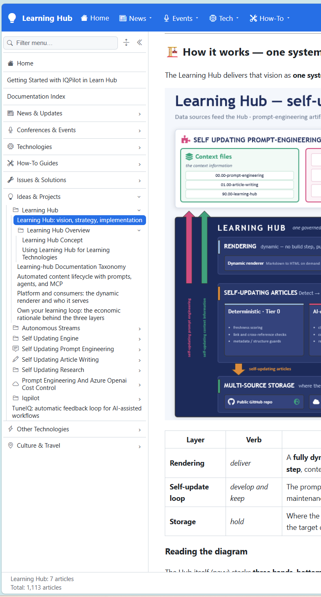
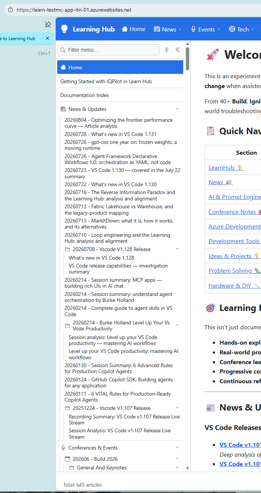
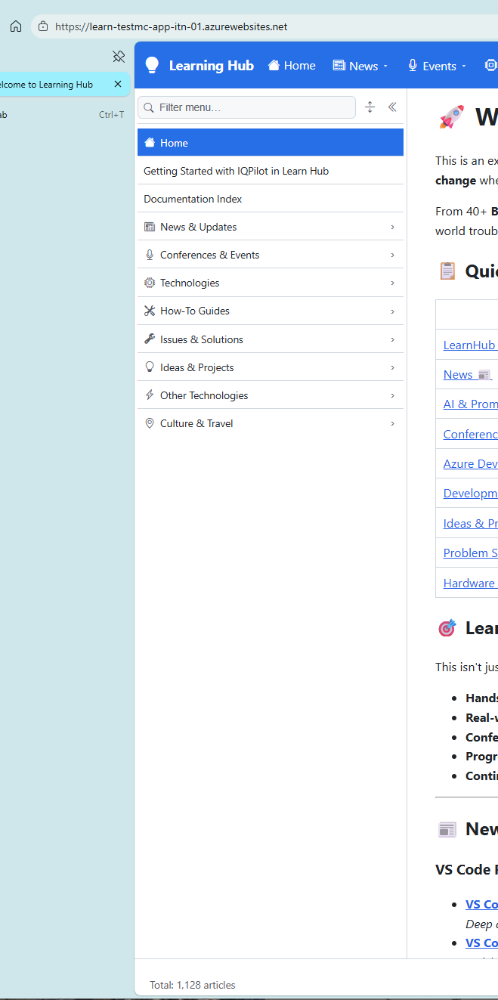

learning hub menu doesn't seem robust 

upon load I see 1100+  articles

upon refresh and expand all I see the counter starting from 0 and going up to 1100+ articles

upon startup and after refresh the counter doesn't even seem consistent 

please analyze how articles counter logic is implemented.

in my understanding
- startup server side rendering should render the current page and left navbar index up to the visible nodes + 2 levels.
- so startup rendering should start at least with that articles count.
- after returning to the browser, background fetch should be triggered to get the full articles count and fetch the rest of the articles in the background.

at any level, articles count should be maintained and updated into folder metadata information (_metadata.yml).
so that at any level, the total couunt of articles should just be a sum of the articles count of all the child nodes.
also when a child count is changed root total count would never start from 0, it should be updated to reflect the new individual counts of its children.

when reporcessing any node total count, in case of count change, the parent node should be notified so that it can refresh its own count and notify its parent node, and so on up to the root node.
in this way, every node will always update its count without ever starting from '0'.

parent notifications should always be asynchronous process, so that in case any number of notifications come for a single node, only the last can be processed and the others can be ignored (still ensuring the folder article count to be up to date).

NB. all this notification logic is happening at the server side to make sure every folder has up-to date article count metadata information.

every single metadata information change should be notified to the client so that it can be shown to the status bar.
(please choose how metadata information changes can be notified to the client in an efficient way so that the client can record them together with article folders to be rendered)

can you see the logic? 
does it seem sound, flexible and efficient for you?
can you see any improvemnents or potential issues with this approach?

