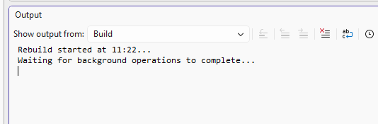

# Issue analysis — Visual Studio build blocked by restore TLS and output lock

**Issue title:** Visual Studio build blocked before compilation, then failing on Learn.Web executable lock  
**Date reported:** 2026-08-13  
**Date analyzed:** 2026-08-13  
**Reporter:** Dario Airoldi  
**Status:** Resolved  
**Severity:** High  
**Component:** Learn solution build pipeline (`Learn.sln`, `Learn.Web`, NuGet restore path)  
**Framework:** .NET 10 (`net10.0` for web projects, `net8.0` for IQPilot)



---

## Table of contents

- [📝 Description](#-description)
- [🔍 Context information](#-context-information)
- [🔬 Analysis](#-analysis)
- [🔄 Reproduction steps](#-reproduction-steps)
- [✅ Solution implemented](#-solution-implemented)
- [📚 Additional information](#-additional-information)
- [✔️ Resolution status](#-resolution-status)
- [🎓 Lessons learned](#-lessons-learned)
- [📎 Appendix](#-appendix)

---

## 📝 Description

### Brief description

Visual Studio showed "Waiting for background operations to complete" and the build appeared blocked.
The first real failure was package restore: NuGet could not establish a TLS session with `https://api.nuget.org/v3/index.json` (`NU1301`, Schannel handshake failure). After restore was rerouted and completed, the build moved forward and then failed because `Learn.Web.exe` was locked by a running process.

### Error signals captured

- `NU1301`: unable to load service index for `https://api.nuget.org/v3/index.json`
- TLS details: "Could not create SSL/TLS secure channel" / Schannel `SEC_E_ILLEGAL_MESSAGE` and `HandshakeFailure`
- `MSB3027` and `MSB3021`: failed to copy `apphost.exe` to `Learn.Web.exe` because the target executable was in use

### User impact

- Full solution rebuild was blocked in Visual Studio.
- Build confidence was reduced because the editor state suggested an internal Visual Studio block while the root causes were external restore connectivity and a local file lock.

---

## 🔍 Context information

### Environment summary

| Item | Value |
|---|---|
| OS | Windows 10.0.26200 |
| SDK in use | .NET SDK 10.0.400 |
| Solution | `src/Learn.sln` |
| NuGet source (before) | `https://api.nuget.org/v3/index.json` |
| NuGet source (after) | `https://www.nuget.org/api/v2/` |

### Observed diagnostics

| Area | Observation |
|---|---|
| DNS/TCP | `api.nuget.org:443` resolved and TCP probe succeeded |
| HTTP TLS | `curl` and PowerShell failed TLS handshake to `api.nuget.org` |
| Alternate endpoint | `https://www.nuget.org/api/v2/` responded correctly |
| Build lock | `Learn.Web.exe` was held by running process ID 704 |

### Files involved

- `nuget.config`
- `src/Learn.sln`
- `src/Learn.Web/bin/Debug/net10.0/Learn.Web.exe`

---

## 🔬 Analysis

### Root cause analysis

| # | Root cause | Evidence |
|---|---|---|
| 1 | TLS handshake failure to NuGet v3 endpoint | `NU1301`, Schannel handshake failure against `api.nuget.org` |
| 2 | Visual Studio background restore waiting on failed network path | UI symptom: waiting background operations before normal compile pipeline |
| 3 | Locked `Learn.Web.exe` during rebuild | `MSB3021/MSB3027` with explicit lock owner `Learn.Web.exe (704)` |

### Why this looked like one issue

Visual Studio initially surfaced only the background-operation symptom. That masked the actual chain:

1. Restore could not negotiate TLS with `api.nuget.org`.
2. Once restore was redirected, compilation proceeded.
3. Rebuild then hit a separate local lock on output executable.

This produced a multi-stage failure that looked like a single blocked build.

### Impact assessment

- **Build reliability:** High impact until restore and lock conditions were both resolved.
- **Scope:** Developer machine / local workflow, not source-code compilation logic itself.
- **Risk:** Medium recurrence risk if endpoint behavior or local running-process discipline is unchanged.

---

## 🔄 Reproduction steps

1. Open the solution in Visual Studio.
2. Trigger a rebuild while `nuget.config` points to `https://api.nuget.org/v3/index.json`.
3. Observe background build wait and restore errors (`NU1301`) in output/logs.
4. After forcing successful restore via alternate endpoint, rebuild again while `Learn.Web.exe` is still running.
5. Observe `MSB3021/MSB3027` copy failure caused by output file lock.

### Minimal command-line repro used in diagnosis

```powershell
dotnet build .\src\Learn.sln --no-restore --verbosity:minimal
```

---

## ✅ Solution implemented

### Fix overview

Two independent fixes were applied in sequence:

1. **Restore path fix**: switched repository NuGet source from v3 API host to reachable v2 endpoint.
2. **File lock fix**: stopped/released the running `Learn.Web.exe` process before rebuild.

### Code/config change

`nuget.config` was updated from:

```xml
<add key="nuget.org" value="https://api.nuget.org/v3/index.json" protocolVersion="3" />
```

to:

```xml
<add key="nuget.org" value="https://www.nuget.org/api/v2/" protocolVersion="2" />
```

### Final verification

```text
Learn.Web.Shared net10.0 succeeded
IQPilot net8.0 succeeded
Learn.Web.Client net10.0 browser-wasm succeeded
Learn.Web net10.0 succeeded

Build succeeded in 26.8s
```

---

## 📚 Additional information

### Recommendations

- Keep only one authoritative NuGet source in repo-level `nuget.config` for deterministic restore.
- Before rebuild, ensure no previously launched `Learn.Web.exe` instance is still running.
- If Visual Studio shows background build wait again, immediately validate restore separately via `dotnet restore` and inspect TLS endpoint reachability.

### Operational checklist for future incidents

- Confirm endpoint-level reachability and TLS behavior per host, not only DNS/TCP.
- Separate restore diagnostics from compile diagnostics.
- Treat output-lock failures as an independent stage, even when triggered in the same rebuild attempt.

---

## ✔️ Resolution status

### Resolution timeline

1. Confirmed Visual Studio symptom and reproduced in CLI. (✅ done)
2. Identified NuGet TLS handshake failure on `api.nuget.org`. (✅ done)
3. Validated alternate source `www.nuget.org/api/v2` works. (✅ done)
4. Updated repo `nuget.config` to reachable source. (✅ done)
5. Rebuilt and identified second-stage output lock on `Learn.Web.exe`. (✅ done)
6. Released lock and reran build successfully. (✅ done)

### Follow-up actions

- Monitor whether `api.nuget.org` TLS path recovers in this environment. (📌 next steps)
- Re-evaluate moving back to NuGet v3 endpoint when stable. (📌 next steps)
- Consider adding local dev guidance for avoiding output locks during rebuilds. (🟡 todo)

---

## 🎓 Lessons learned

- A blocked Visual Studio build can hide a staged failure sequence.
- Endpoint-specific TLS failures can affect one host while other HTTPS hosts remain healthy.
- Successful restore does not guarantee rebuild success if a process still locks output binaries.
- Fast CLI checks (`restore`, then `build`) are the quickest way to separate UI symptom from root cause.

---

## 📎 Appendix

### Reference files

- `nuget.config` (updated source endpoint)
- `src/Learn.sln` (verified full solution build)
- `src/docs/90. Issues/202608/20260813.02-learnbuild-fix/overview.md` (issue capture)

### External references

- **[NuGet error NU1301 documentation](https://learn.microsoft.com/nuget/reference/errors-and-warnings/nu1301)** 📘 [Official]  
  Describes service-index access failures and typical restore troubleshooting flow.
- **[MSBuild copy-file errors and build output locks](https://learn.microsoft.com/visualstudio/msbuild/errors/msb3021?view=vs-2022)** 📘 [Official]  
  Covers file copy failures during build and common causes such as locked target files.
- **[MSBuild retry exceeded (MSB3027)](https://learn.microsoft.com/visualstudio/msbuild/errors/msb3027?view=vs-2022)** 📘 [Official]  
  Explains repeated copy retries and failure when lock conditions persist.
