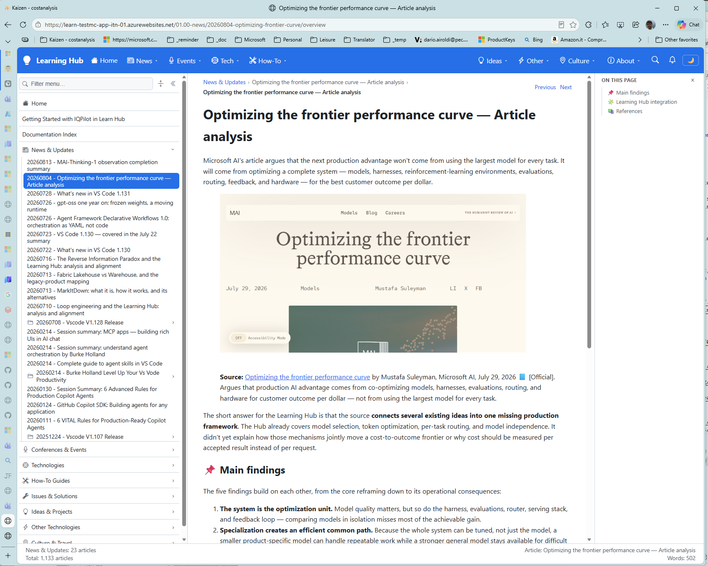
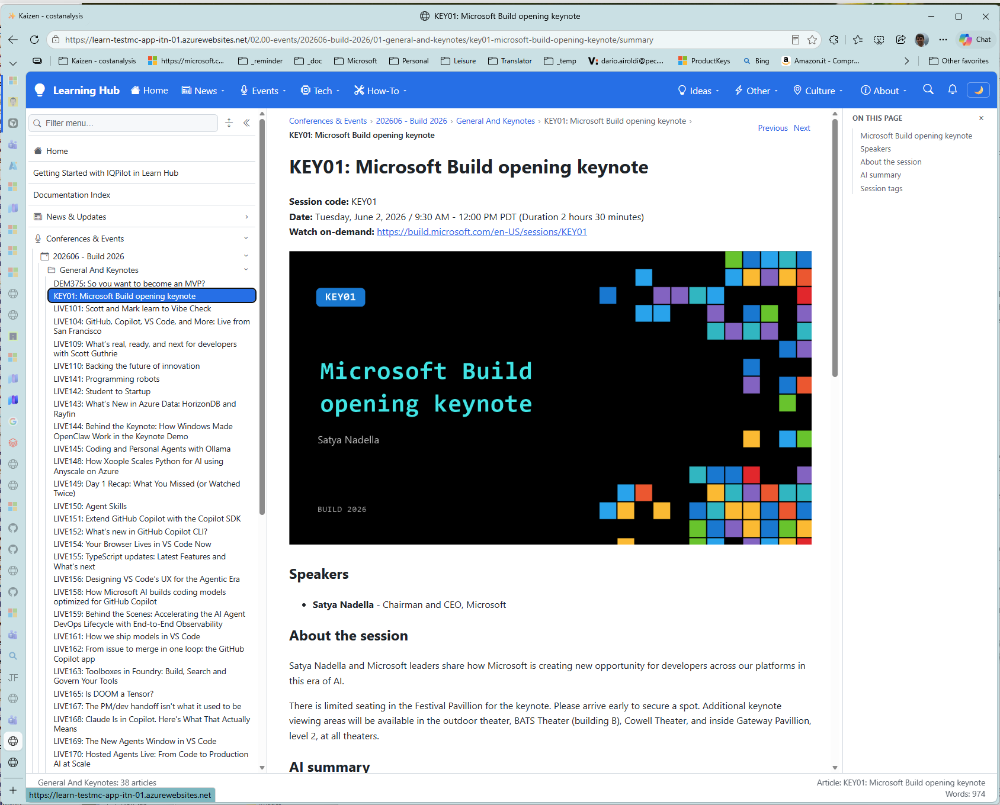

# Learning Hub — hackathon submission description

This page holds the **submission body** for the Learning Hub project, assembled from the canonical vision and
its correlated areas: the [self-updating engine](../../../../../06.00-idea/05.00-self-updating-engine/20260622.01-self-updating-engine-vision.md),
the three domain streams ([article writing](../../../../../06.00-idea/05.02-self-updating-article-writing/20260428.01-vision.v1.md),
[prompt engineering](../../../../../06.00-idea/05.01-self-updating-prompt-engineering/20260531.01-vision.md),
[research](../../../../../06.00-idea/05.03-self-updating-research/01.000-vision.v1.md)), and
[autonomous streams](../../../../../06.00-idea/07.00-autonomous-streams/autonomous-streams.md).

## 📋 Table of contents

- [✂️ Submission body — paste from here](#️-submission-body--paste-from-here)
- [🖼️ Media appendix — images referenced above](#️-media-appendix--images-referenced-above)
- [📐 Claim ledger — what is built vs designed](#-claim-ledger--what-is-built-vs-designed)
- [📚 References](#-references)

---

## ✂️ Submission body — paste from here

### Overview

**Learning Hub** is an intelligent platform that turns everything you meet — from any source you
decide to use, in any medium — into **living knowledge that is yours**, with an — **AI that thinks *with* you,
not *for* you** —.  

It is designed for anyone — engineers, researchers, students, and teams — who wants to explore any subject,
from technology and languages to medicine, art, music, and travel, and turn scattered information into
knowledge that is true, current, verified, and connected — so they can learn ahead, go deeper, and make more
of what they discover.

learning hub article analysis

Keeping up is rarely a question of effort. You attend the conference, you save the recording, you subscribe
to the feed — and none of it becomes knowledge. The recording is watched once and never opened again. The
article you wrote in May is quietly wrong by August, and nothing tells you. The gap that will embarrass you
next quarter is invisible today, because search only finds what you already thought to ask for.

Learning Hub was built to close exactly that loop. Instead of a place where information is filed, it is a
**cycle**: information is gathered from wherever you decide it lives, kept in a store you control, developed
rather than stored, argued with rather than absorbed — and then continuously watched, so that when the world
moves the Hub notices, proposes the correction, and waits for your approval before touching anything.

`learning-hub-architecture.png`

Learn information is:
- self-gathered and analyzed
- self-verified against reliable sources
- self-checked for redundancy and unnecessary duplication
- self-monitored for obsolescence and outdated information
- self-analyzed for contradictions, inconsistencies, and conflicting claims
- self-connected to related knowledge
- self-organized into a clear, accessible structure
- self-updated as sources and understanding evolve
- self-aware of gaps, uncertainty, and conflicting evidence
- self-investigated for logical developments, new connections, and opportunities to think further ahead
- self-improved through feedback, corrections, and human guidance

## 🎯 The problem we set out to solve

Six failures shaped the design, and each one is difficult to see while it is happening.

1. **Information is consumed once and lost.** A ninety-minute conference session sits in personal storage,
   watched once, never developed. A newsletter is read and closed. The material was valuable, the effort was
   spent, and nothing compounded.
2. **Knowledge remains scattered instead of becoming yours.** Notes, recordings, articles, and saved links
   remain separate items. They are not brought together so that you can understand them, develop them, and
   improve the ideas they contain.
3. **Your knowledge has no deliberate home or boundary.** Public and private material often lives in separate
   systems with different rules. You need knowledge hubs that you own, protect when necessary, scope to specific
   subjects, and connect to one another according to your rules.
4. **Knowledge ages silently.** Published content does not fail loudly. A stale article still renders, still
   ranks, still gets read. The reader experiences degradation as confusion, not as an error — so nobody
   raises a bug, and the correction never happens.
5. **You cannot search for what you do not know.** The most expensive gaps are the ones you cannot name. A
   search box answers questions you already have; it never tells you which question you should have asked or
   where your current understanding could develop next.
6. **Using AI quietly exports your judgement.** Every correction you make when a model is wrong is
   accumulated judgement about what "good" means for you. By default that judgement flows outward, to
   whoever owns the model, instead of compounding for you.

Learning Hub addresses all six: it gathers and develops information into knowledge that is yours, organizes it
into protected or public hubs with subject scope and owner-defined connections, keeps it current and evidence-
based, surfaces gaps and possible directions for further development, and keeps the judgement accumulated by
the learning loop inside a trust boundary you control.

### How the solution works

#### A cycle, not a pipeline

The Hub runs five moves, and the fifth produces the first again.

- **Gather** — reach your information wherever you decide it lives, in any medium, including what you did not know to look for.
- **Keep** — nothing is read once and discarded; every worthwhile piece joins a store you control.
- **Enrich** — each piece is *developed*, not merely stored: analysed, connected to what you already know, checked for gaps and stale facts.
- **Learn in context** — the AI pushes back on weak claims, opens lines you had not considered, and hands your gaps back as the next question.
- **Think ahead** — fresh information becomes implications *for you*, and your knowledge gaps surface before they bite.

*Think ahead* produces the next *Gather*. That is why the Hub is a cycle rather than an archive: every pass
leaves you with a better question than the one you started with.

#### Any source, any medium — wherever you decide it lives

Content enters through one general pipeline rather than a bespoke connector per source: feeds and newsletters,
conference and event material, meetings and talks, papers and vendor documentation, non-text material such as
recordings and diagrams, and your own notes and corrections. None of these is a special case.

The **conference and event channel** is the flagship, and it is fully exercised: session catalogs are
discovered, transcripts and slides are ingested, summaries and deep analyses are generated, and navigation is
wired automatically. The repository currently holds **286 governed session documents** across Build 2026,
Ignite 2025, and Build 2025 — produced by that pipeline, not by hand.

Crucially, **non-public material is read in place**. Private recordings, internal decks, and personal notes
are resolved from an access-controlled mirror and never copied into the public repository. The Hub can learn
from material it is not allowed to publish.

`events-ingestion.png`

#### Detect → Assess → Propose → Execute — under human governance

The heart of the system is a portable maintenance loop with a **risk-calibrated autonomy gradient**:

| Autonomy level | Scope | Examples |
|---|---|---|
| **Autonomous** | Low impact, high confidence | Deterministic fixes, metadata refresh, broken-link repair |
| **Autonomous with notification** | Low-medium impact, validated | Verified version update, redundancy removal after validation |
| **Human approval required** | High impact or medium confidence | Rule and behaviour changes, scope expansion, external adoption |
| **Human-only** | Architectural or strategic | Vision, principles, and threshold changes |

The gap between **Propose** and **Execute** is where governance lives. When the loop finds that a claim has
been superseded, it does not quietly rewrite a page you stopped watching — it produces a proposal, cites the
trigger, the assessment, and the evidence, and stops.

What the loop is permitted to change is **declared, not assumed**. Every governed artifact carries its own
`goal`, `scope`, `boundaries`, and prioritised `principles` in metadata; every change is validated against
that contract before it applies and reconciled after. Nothing applies without a pre-change snapshot and a
one-operation rollback.

`freshness-proposal.png`

#### One engine, many streams

There is **one engine and many streams**, not four separate systems. The engine ships the verbs — detect,
assess, classify risk, guard, roll back, learn. Each domain supplies only the nouns: what an artifact is,
what makes it stale, and what "good" means.

| Stream | What it maintains | How it detects degradation |
|---|---|---|
| **Article writing** | Published articles and series | Freshness scoring, claim verification, link and cross-reference integrity, collection coherence |
| **Prompt engineering** | The AI customization stack itself | Platform drift, standards drift, cross-artifact contradiction |
| **Research** | New knowledge and its sources | Discover → Validate → Reason → Synthesize, with source triangulation |
| **Future streams** | Documentation, validation, and more | Configuration on the same engine — no new machinery |

Improve the engine once, and every stream inherits the improvement. That portability is the whole design bet.

#### An AI that thinks with you

Assessment is **cost-stratified**: cheap deterministic checks run first (Tier 0), lightweight model review
next (Tier 1), and deep reasoning only when the evidence demands it (Tier 2). Expensive reasoning is spent on
judgement, not on counting.

And judgement is what the AI is asked for. It challenges claims that only one source supports. It refuses to
present a single-source assertion as established fact. It opens connections between things you wrote months
apart. When you overrule it — because a table it wanted to delete compares *failure modes* rather than
*capabilities* — that correction does not evaporate: it becomes part of how the Hub proposes things to you
afterwards.

Research carries its own safeguard against the failure mode that makes LLM research dangerous: **every claim
requires at least two independent sources** before it is treated as established, single-source findings are
labelled *emerging*, and reasoning-derived conclusions are labelled as such and escalated for review.

`gap-surfaced.png`

#### Live delivery, with no build step

Content is delivered by **Diginsight SmartDocs**, a fully dynamic Markdown renderer: Markdown becomes HTML at
request time, navigation is built at runtime from the live content hierarchy, and there is **no build step and
no static output**. A file that lands is live on the next request. Publishing collapses to *"make the Markdown
available."*

This is also what lets an autonomous stream be useful: an approved correction is visible immediately, with
nothing to regenerate.

### Key capabilities

- **Multi-source, multi-medium ingestion** — feeds, events, meetings, papers, recordings, diagrams, and your own notes, through one pipeline.
- **Conference and event pipeline** — catalog discovery through transcripts, summaries, deep analyses, and automatic navigation wiring.
- **Governed Markdown** — a dual-metadata contract on every article: identity frontmatter plus validation tracking.
- **Cost-stratified quality assessment** — Tier 0 deterministic, Tier 1 lightweight model, Tier 2 deep reasoning.
- **Freshness scoring and staleness classification** — structural staleness (broken links, missing metadata) separated from capability staleness (a claim that quietly stopped being true).
- **Hallucination resistance** — source triangulation, claim grounding, graded confidence, and reference classification by source reliability.
- **Risk-calibrated autonomy** — four-level gradient, evidence-cited proposals, metadata guards, snapshot and rollback.
- **Gap surfacing and foresight** — the Hub reads what you already hold and hands back the hole in its shape as the next question.
- **Public/private trust boundary** — non-public material read in place from an access-controlled mirror, credited but never copied.
- **Live rendering with runtime navigation** — no build, no static output, content live on the next request.
- **Deterministic tooling** — an MCP server exposing validation, metadata, and workflow tools so predictable work never costs model reasoning.

### Ownership, governance and responsible design

The Hub's central bet is that the **learning loop belongs to its owner**, so governance is an architectural
constraint rather than a feature added at the end.

- **Propose is not execute.** Reader-facing and rule-changing modifications stop at a human. Vision, principles, and autonomy thresholds are human-only and may never be changed by an autonomous process.
- **Every change is reversible.** No change applies without a pre-change snapshot and a one-operation rollback.
- **Every change is evidence-based.** A proposal cites the trigger that surfaced it, the assessment that scored it, and the evidence behind the score. Presence of a check is never accepted as evidence that its property holds.
- **Nothing crosses the trust boundary without consent.** What is public and what stays behind authentication is a deliberate declaration, enforced as access control, not a default.
- **No unsourced assertions.** Factual claims carry sources, and sources carry a reliability classification — official, verified community, community, or unverified.
- **Model-agnostic by design.** Orchestration is decoupled from any single model, so removing one model does not remove the ability to operate.
- **The loop must be stable.** It converges toward a fixed point and freezes and escalates on divergence or oscillation — a self-update loop that oscillates does more harm than no loop at all.
- **It stays quiet when content is healthy.** A system that constantly demands attention is worse than manual audits.

### Technology

`learning-hub-architecture.png`

**Rendering.** Diginsight SmartDocs — a .NET dynamic Markdown-rendering application (server host plus
WebAssembly client and a shared razor class library) that renders Markdown to HTML on demand and builds its
navigation at runtime from the content hierarchy. Per-folder metadata drives labels, icons, order, and
visibility. It is consumed as an **external building block** in its own repository, not owned by the Hub —
which is the producer-agnostic claim proven rather than asserted.

**Storage.** Content is read from the local filesystem in development or from **Azure Blob Storage** in
production, selected by configuration. The target design serves several stores at once — public and private,
authenticated or not — composed into one navigable whole.

**Hosting and observability.** The site runs on **Azure App Service**, instrumented end to end with Diginsight
telemetry.

**The engine.** The self-update loop runs on **GitHub Copilot's customization stack**, and the numbers are the
point: **84 prompts, 43 agents, 20 instruction files, 63 context files, 154 templates, 12 hooks, 6 prompt
snippets, and 4 skills** — 386 artifacts governing roughly **1,950 Markdown documents**. Artifacts declare their own domain,
scope, and boundaries in metadata, and every maintenance command shares one canonical eight-parameter surface
so a bare invocation is a full review rather than a silently narrowed one.

**Deterministic tooling.** **IQPilot** is a C# **Model Context Protocol server** exposing validation, content,
metadata, and workflow tools over stdio to GitHub Copilot — grammar, readability, structure, fact-checking,
logic, cross-references, and validation caching that stops the same check being paid for twice. A companion
.NET file watcher plus VS Code extension keeps validation metadata synchronised as files change.

**Feedback capture.** **TuneIQ** captures AI execution sessions and analyses them into a prioritised
improvement backlog for the customization stack itself — turning "that prompt felt wrong" into data.

**Cost.** Model routing sends reasoning to a capable model and mechanical edits to a cheaper one, with
progressive assessment depth and validation caching keeping the cost proportional to the change rather than
to the corpus.

### Built with GitHub Copilot

Copilot was not an autocomplete on this project. **Copilot's customization stack is the product's engine.**

The Hub's self-update loop is implemented *as* prompts, agents, instruction files, context files, templates,
hooks, snippets, and skills — **386 customization artifacts** that read, assess, propose, and apply changes to
a governed corpus. The
renderer, the MCP server, the file watcher, the VS Code extension, and the deployment configuration were all
built with Copilot as the primary development accelerator; but the more interesting result is that the
*maintenance* of the system is expressed in the same medium.

That produced a genuine meta-loop. A dedicated command family maintains the customization stack itself:
it detects when the platform has drifted, when two artifacts contradict each other, or when a rule has gone
stale against its authoritative source — and it improves the very artifacts that build and maintain
everything else. The system improves the tools that improve the system, under the same governance gradient
that protects the articles.

**And this description is its own proof.** It was assembled by that loop, from vision documents the loop
governs, into a Markdown file the platform renders live.

### Impact

Technology does not replace the learner, the team, or the expert — it removes the reasons their knowledge
decays. Learning Hub makes learning continuous, connected, and owned, which is what it takes to move from
keeping up to thinking ahead.

The measure of success is not how impressive the machinery looks. It is whether the recording you attended
becomes something you can reason from. Whether the claim you published in May is still true in August, or was
flagged before you repeated it in front of a customer. Whether the gap that would have caught you out arrived
as a question first. And whether the correction you made last month makes next month's work better — for you,
and for the people you learn with.

Own the loop, and the knowledge compounds. That is the whole idea.

---

## 🖼️ Media appendix — images referenced above

| Placeholder in the body | Status | Source |
|---|---|---|
| `learning-hub-architecture.png` | **Available** | [001.01-learning-hub-architecture.v1.png](../../../../../06.00-idea/00.00-learning-hub/00-learning-hub/images/001.01-learning-hub-architecture.v1.png) |
| `learning-hub-live-site.png` | **Available** | [002.01-learning-hub-live-site.png](../../../../../06.00-idea/00.00-learning-hub/00-learning-hub/images/002.01-learning-hub-live-site.png) |
| `events-ingestion.png` | **To capture** | A Build 2026 session folder in the sidebar next to a generated summary — shows the pipeline output at scale |
| `freshness-proposal.png` | **To capture** | A staleness proposal awaiting approval — the pause between Propose and Execute |
| `gap-surfaced.png` | **To capture** | A surfaced knowledge gap next to the articles that produced it — no search box involved |

The architecture diagram is the strongest single asset: it shows the three bands (storage, self-update logic,
rendering), the customization stack governing them from above, the data sources feeding them from the right,
and the three colour-coded self-update loops writing back.

## 📐 Claim ledger — what is built vs designed

Nothing in the submission body over-claims, but keep this ledger to hand for judging questions.

| Claim in the body | Reality |
|---|---|
| Live rendering, runtime navigation, no build step | **Built and live** |
| Azure Blob or filesystem content source, config-selected | **Built and live** (one target per instance) |
| Governed Markdown, dual-metadata contract, validation caching | **Built** |
| Event ingestion pipeline and 286 session documents | **Built** — the documents exist in the repository |
| IQPilot MCP server and metadata watcher | **Built** |
| 386 customization artifacts across eight types | **Built** — counted in the repository |
| Detect → Assess → Propose → Execute with the autonomy gradient | **Design-strong, partly wired** — runs when a command is invoked, not yet on a schedule |
| Gap surfacing and scheduled staleness detection | **Design-strong, partly wired** — same caveat |
| Several storage targets served as one, authenticated private mirror | **Design** — the target the diagram shows |
| TuneIQ session capture and analysis | **Design**; capture partly wired |
| Team and collaborative learning | **Declared intent (P2)** — do not claim as shipped |

Where a demo is required, the five-beat walkthrough in
[The thing you didn't know to look for](../../../../../06.00-idea/00.00-learning-hub/00-learning-hub/01-what-it-feels-like.md)
runs in under five minutes and lands the governance pause as its closing point.

## 📚 References

### Internal references

- [Learning Hub: vision, strategy, implementation](../../../../../06.00-idea/00.00-learning-hub/00-learning-hub/00-learning-hub.md) — the canonical definition, the five-move cycle, and the three layers.
- [Architecture: one system in three layers](../../../../../06.00-idea/00.00-learning-hub/00-learning-hub/02-architecture.md) — the diagram, the loops, and the implementation status table.
- [The thing you didn't know to look for](../../../../../06.00-idea/00.00-learning-hub/00-learning-hub/01-what-it-feels-like.md) — the five-beat demo walkthrough.
- [Own your learning loop](../../../../../06.00-idea/00.00-learning-hub/05-own-your-learning-loop.md) — Control / Capability / Choice / Cost / Compound and the trust boundary.
- [Platform and consumers](../../../../../06.00-idea/00.00-learning-hub/04-platform-and-consumers.md) — the renderer and the audiences it generalizes to.
- [Self-updating engine vision](../../../../../06.00-idea/05.00-self-updating-engine/20260622.01-self-updating-engine-vision.md) — the portable loop, the autonomy gradient, and the metadata guards.
- [One engine, many streams](../../../../../06.00-idea/05.00-self-updating-engine/00-one-engine-many-streams.md) — why the four folders are one system.
- [Self-updating article writing vision](../../../../../06.00-idea/05.02-self-updating-article-writing/20260428.01-vision.v1.md) — quality dimensions, degradation forces, cost tiers.
- [Self-updating prompt engineering vision](../../../../../06.00-idea/05.01-self-updating-prompt-engineering/20260531.01-vision.md) — the meta-loop and the canonical command surface.
- [Self-updating research vision](../../../../../06.00-idea/05.03-self-updating-research/01.000-vision.v1.md) — triangulation and hallucination resistance.
- [Autonomous streams](../../../../../06.00-idea/07.00-autonomous-streams/autonomous-streams.md) — engine, stream, and loop-engineering vocabulary.
- [IQPilot overview](../../../../../06.00-idea/iqpilot/01-iqpilot-overview.md) — the content-quality product.
- [TuneIQ design](../../../../../06.00-idea/tuneiq/01-tuneiq-design.md) — session capture and the improvement backlog.

### External sources

**[The Reverse Information Paradox](https://snscratchpad.com/posts/reverse-information-paradox/)** 📒 [Community]
Names Control / Capability / Choice / Cost / Compound and the trust-boundary argument behind the ownership section.

**[Model Context Protocol](https://modelcontextprotocol.io/)** 📗 [Verified Community]
The open standard IQPilot implements to expose deterministic tools to GitHub Copilot.

**[Diátaxis](https://diataxis.fr/)** 📗 [Verified Community]
The documentation framework the Hub's content taxonomy extends.

<!--
validations:
  grammar: {status: "not_run", last_run: null}
  readability: {status: "not_run", last_run: null}
  technical_accuracy: {status: "not_run", last_run: null}
  reference_classification: {status: "not_run", last_run: null}
article_metadata:
  filename: "overview.md"
  created: "2026-09-05"
  content_type: "work-item"
  subject: "learning-hub"
-->
